```{r setup, include=FALSE}
knitr::opts_chunk$set(echo = FALSE)
```

# 1.0 Critique of Visualisation

The original visualisation can be seen below:


 
Generally, the graph is beautiful but confusing. It has a good and consistent color scheme. The use of trellis display with time-series data conveys the intent of the graph.

Nonetheless, there are plenty of areas to improve with regards to clarity and aesthetics of the graph as discussed below:

## 1.1	Clarity

1.	The title of the graph is not accurate. In terms of total trade (import + export) for 2019-2020 according to the [Merchandise Trade by Region/Market](https://www.singstat.gov.sg/find-data/search-by-theme/trade-and-investment/merchandise-trade/latest-data), Indonesia should be included in the ‘Top Six Trading Countries’ while Japan should be excluded. Nevertheless, for total merchandise imports, Japan is ranked 5th while for total merchandise exports, it is ranked 6th.

2.	The date of the graph is not consistent. The title indicates that is for the year 2019-2020. However, the date for individual graphs shows the year 2019-2021 while the date for Japan only shows 2020.

3.	The different y-axis scales for the Export and Import can cause misinterpretation. For example, China seems to have higher Import compared to export as shown in the area chart. However, upon examining the 2 y-axes, Export has a range 0 to 8M while Import has a range of 0 to 6M which means that export is generally higher than import.

4.	The different y-axis scale makes it difficult to compare the trade values across countries. Visually, it seems that Japan has higher trade values compared to others. However, Japan y-axis scales has a range of 0-2M which is significantly lower than Mainland China with range of 0-8M and US with range of 0-6M.

5.	Graphical integrity needs to be improved. The y-axis should be in billion instead of million since the data source indicates “(Thousand Dollars)” so the raw trade values need to be multiplied by 1000.

## 1.2	Aesthetic

1.	The graph does not have subtitle which can be used to convey intent and additional information. It also does not indicate the data source.

2.	The area charts hide the export and import information and make it difficult to interpret the graph. Additionally, the area charts render 3 colors instead of 2, probably because of adjusted opacity percentage. The third color is when the export and import overlap which again can cause misunderstanding.

3.	The name of the country is not center aligned. The Import secondary y-axis is also too close to the name of the country heading.

4.	The x-axis title is not consistent with the label. The x-axis indicates ‘Month of Period’ but shows the year 2019, 2020 and 2021. Additionally, there are no tick marks which can represent the months.

5.	The trellis display of each country is not rendered equally and evenly. Japan looks too narrow while Mainland China and Malaysia are a bit wider.

6.	The legend title ‘Measure Names’ is not intuitive. The graph does not include annotations to tell interesting data stories.

# 2.0 Alternative Design

The proposed alternative design leverages on the good qualities of the original visualisation. It keeps trellis display with time-series data for each county. 

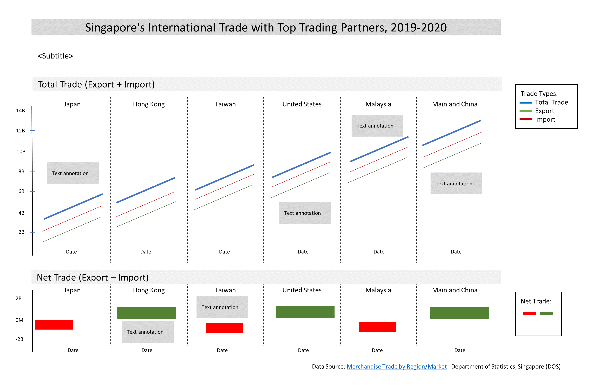
 
With reference to the critiques previously mentioned, the following suggestions are proposed:

## 2.1 Clarity

1.	The title of the graph is updated to ‘Singapore's International Trade with Top Trading Partners, 2019-2020’ to make it more consistent with [SingStat infographics](https://www.singstat.gov.sg/modules/infographics/singapore-international-trade). Subtitle is added to explain that Japan ranked 5th for imports and 6th for exports.

2.	The date of observation period on the x-axis is set to Jan 2019 to Dec 2020 to make it coherent with the title. The x-axis title is also removed since the labels obviously indicate trading dates.

3.	To apply the _rules for encoding values in graph_, line charts are used to display the time-series data. The line charts for Export and Import used the same scale to make it easier to interpret the data. Total Trade line chart is also added to show the total merchandise trade while Net Trade bar chart is included to show the difference of Export and Import.

4.	The same y-axis scale is used across different countries. All countries are placed on a single row instead of multiple rows, so it is easier to compare the trade values. 

5.	The y-axis is set to 0-14B to correctly represent the actual trade values.

## 2.2 Aesthetic

1.	Subtitle is added to convey additional information. Data source is also included to cite Department of Statistics, Singapore.

2.	Line charts were used instead of area charts to easily illustrate the trade values. Green color is used for Export, red for Import and blue for Total Trade. This color scheme is chosen because it adheres to the _practical guides of using color in charts_ and consistent with the graph from the [media release of Enterprise Singapore](https://www.enterprisesg.gov.sg/-/media/esg/files/media-centre/media-releases/2021/may/monthly-trade-report---apr-2021.pdf?la=en).

3.	The name of the country is center aligned. The legends were placed on the right side and were not too close to the country heading.

4.	The x-axis labels were updated to be consistent with the graph title. Tick marks were also added to represent the month.

5.	The trellis display of each country has even spacing and are consistent both for the line and bar charts. Additionally, the countries are arranged in ascending order by Total Trade with linear trend line.

6.	The legend title is updated to ‘Trade Types’. Text _annotations are added to tell interesting data stories_ and insights.

# 3.0 Proposed Data Visualisation

The proposed data visualisation can be seen below and available on Tableau Public through this [link](https://public.tableau.com/app/profile/adolit/viz/DataViz_Makeover01/Dashboard).

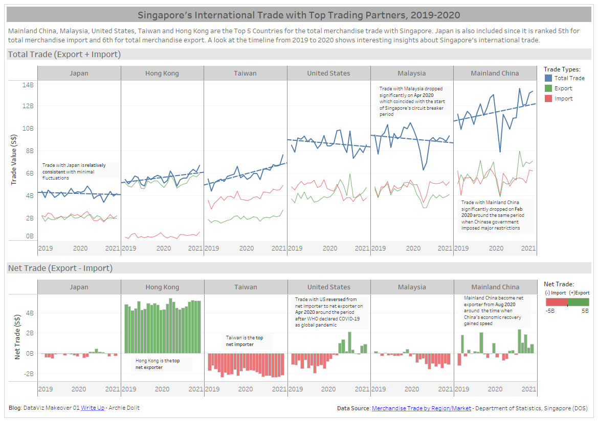


# 4.0	 Step-by-step Guide

## 4.1 Data Understanding
The data is available from [Merchandise Trade by Region/Market](https://www.singstat.gov.sg/find-data/search-by-theme/trade-and-investment/merchandise-trade/latest-data) and can be downloaded by clicking on the link ‘Download all in Excel’ on the same webpage. The file (**outputFile.xlsx**) consists of 3 sheets - Content, T1 which contains merchandise imports, and T2 which contains merchandise exports. The document includes merchandise trade information for more than one hundred countries and regions starting from Jan 1976 up to the present. 

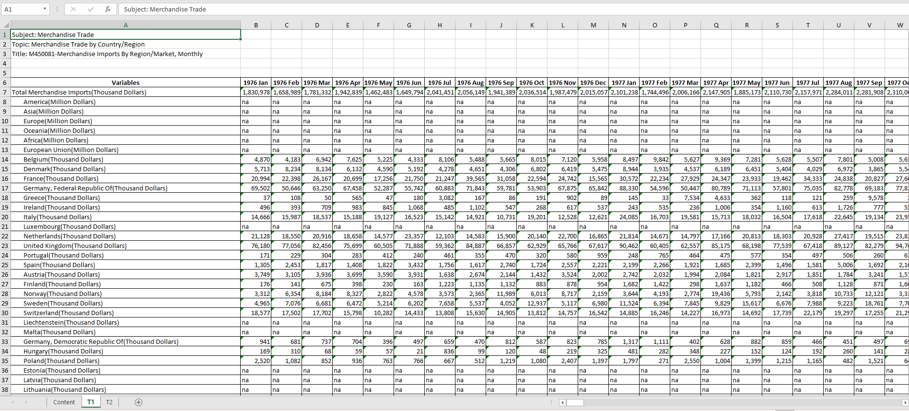 

For this makeover, Japan, Hong Kong, Taiwan, United States, Malaysia, and Mainland China are the primary focus and the visualisation is limited to the period of Jan 2019 to Dec 2020.

The proposed data visualisation is relatively simple since it only consists of 2 charts – line charts for the total trade including import and export, and bar chart for the net trade. However, the current data source format is not readily available for analysis. The data is not organized into tidy rows and columns with proper field labels. Hence, additional effort is needed to transform the raw data into a tidy format that can be used to easily visualize the proposed alternative design.

## 4.2 Data Preparation

1.	Connect the Excel file (**outputFile.xlsx**) to Tableau Prep Builder.

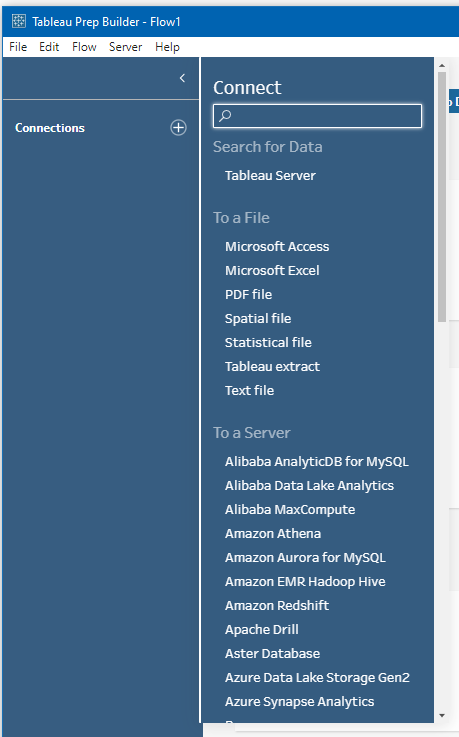{width=50%} 

2.	Drag T1 sheet to start the data flow. Select the relevant Field Name which are ‘Subject: Merchandise Trade’ and ‘F518’ to ‘F541’.

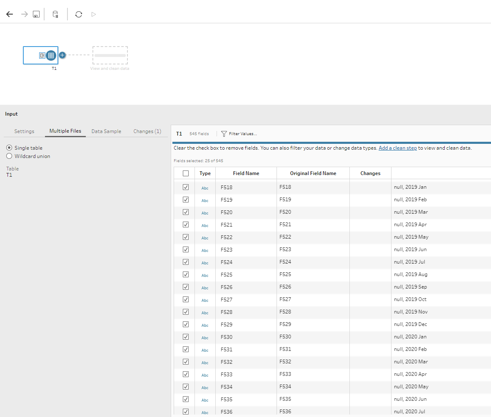 

3.	Click ‘Add a clean step’ hyperlink from the figure above. From the Clean 1, switch the display to ‘Show data grid’ to easily view the data. 

4.	Click on the ellipsis of ‘Subject: Merchandise Trade’ column. Choose ‘Filter’ -> ‘Selected Values’. 

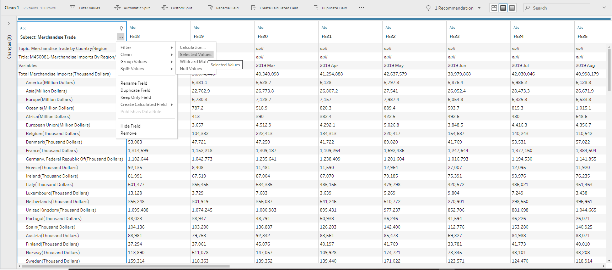
 
5.	Type, search and select individually the terms “Variables, Japan, Hong Kong, Taiwan, United States, Malaysia, and Mainland China”.

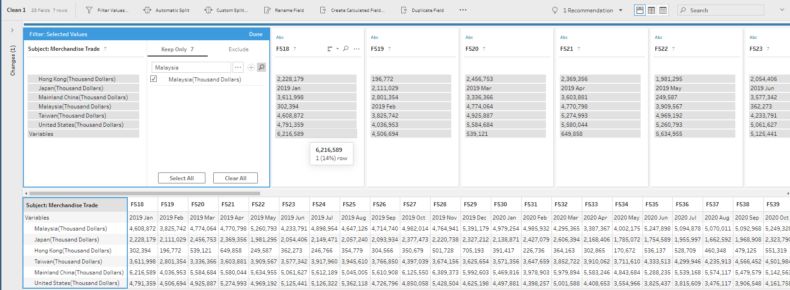 
 
6.	Rename the individual fields to “Country, 2019 Jan, 2019 Feb” until “… 2020 Dec”.

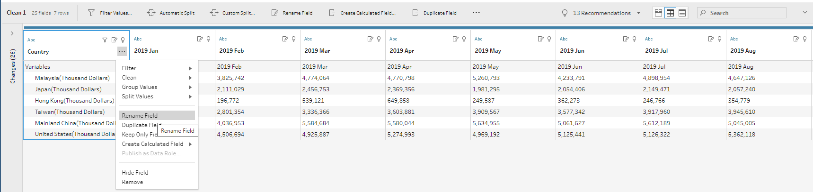 

7.	Right click on the ‘Variables’ and select ‘Exclude’.
 
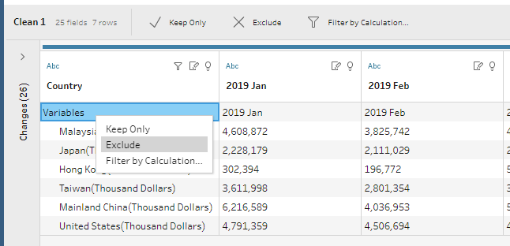{width=80%}

8.	On the data flow diagram, choose the ‘+’ and select ‘Pivot’.
 
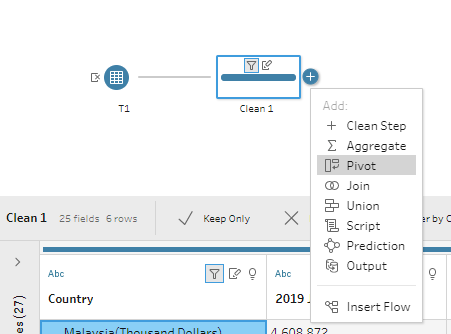{width=80%}

9.	From ‘Pivot 1’, drag all the renamed fields ‘2019 Jan’ until ‘2020 Dec’ to ‘Pivoted Fields’. The ‘Pivot Results’ should be like this:
 
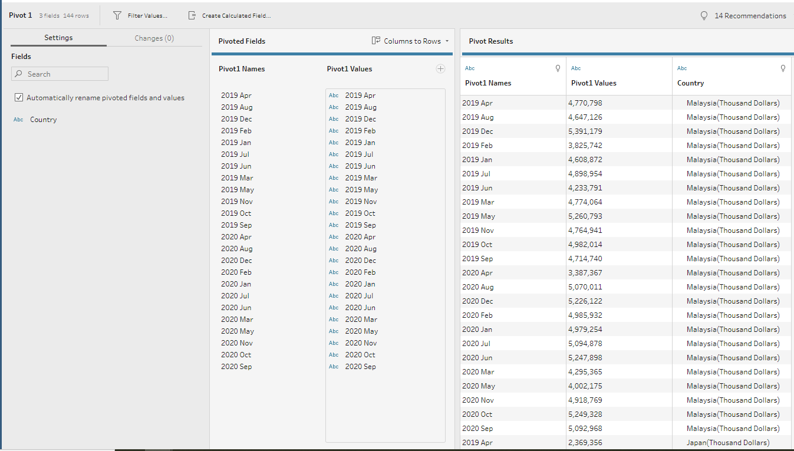
 
10.	Select the ellipsis on the ‘Country’ -> Split Values -> Custom Split and use the separator ‘(‘.
 
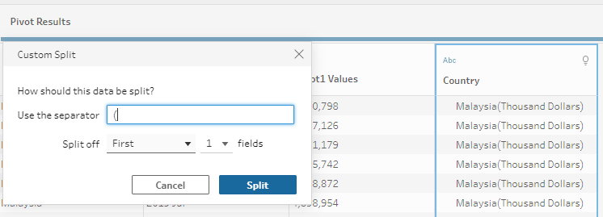

11.	Remove the original ‘Country’ field and rename the ‘Country – Split 1’ to ‘Country’, ‘Pivot1 Names’ to ‘Date’ and ‘Pivot1 Values’ to ‘Import Raw’.

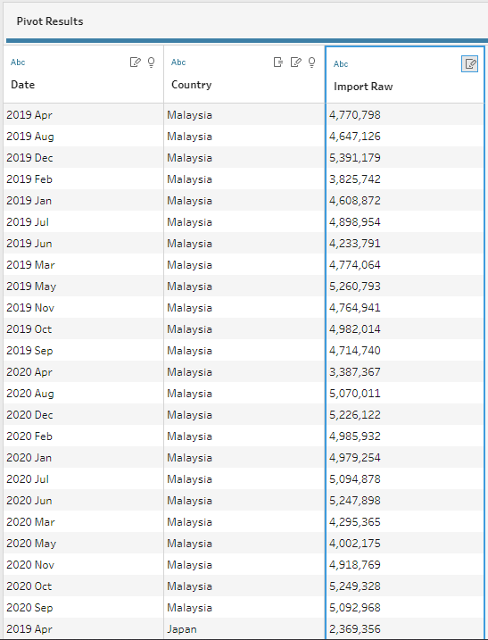{width=80%}
 
12.	Change the data type of Date to ‘Date’ and ‘Import Raw’ to ‘# Number (whole).

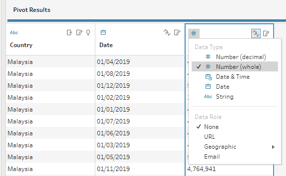{width=80%}

13.	The summary of changes for ‘Clean 1’ and ‘Pivot 1’ are as follows:

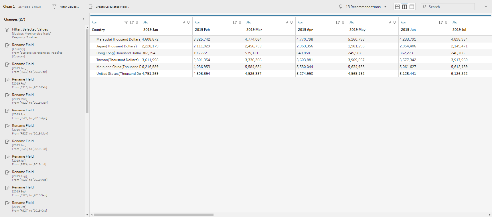


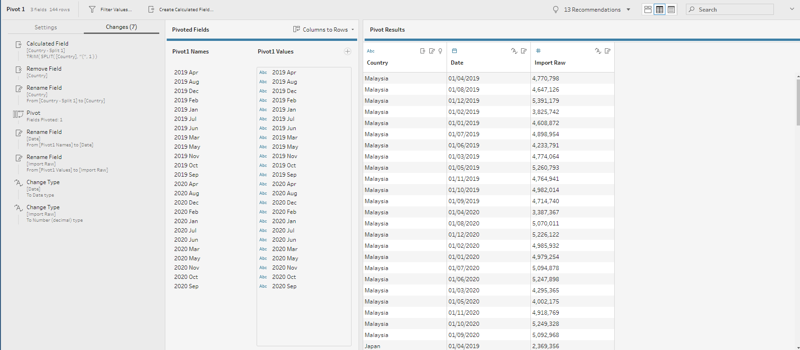

14.	Repeat steps 2-13 for T2 sheet. Note that for steps 11-12, it should be changed to ‘Export Raw’ instead of ‘Import Raw’. The results should be similar to this:

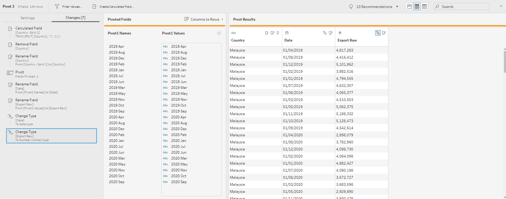

15.	On the data flow diagram, drag Pivot 2 towards Pivot 1 and select Join 

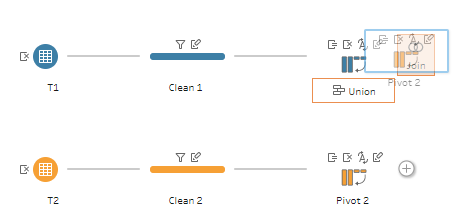

16.	Apply the Join Settings where Pivot 1 Country = Pivot 2 Country; and Pivot 1 Date = Pivot 2 Date; Join Type: full.

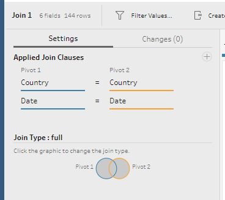{width=60%}

17.	From the Join Results, remove ‘Country(Country -1)’ and ‘Date(Date-1) since these are redundant information.

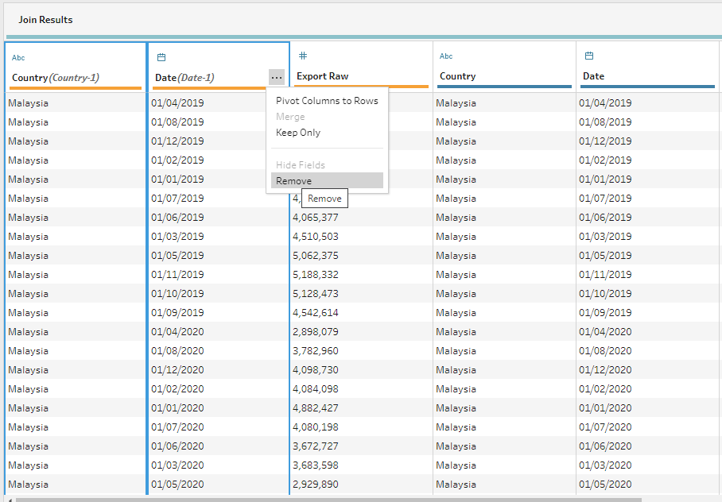

18.	Click on the ellipsis of Export Raw -> Create Calculated Field -> Custom Calculation. Create a new field ‘Export’ by multiplying the Export Raw by 1000.

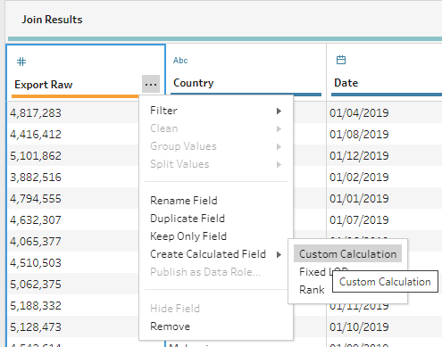{width=80%}

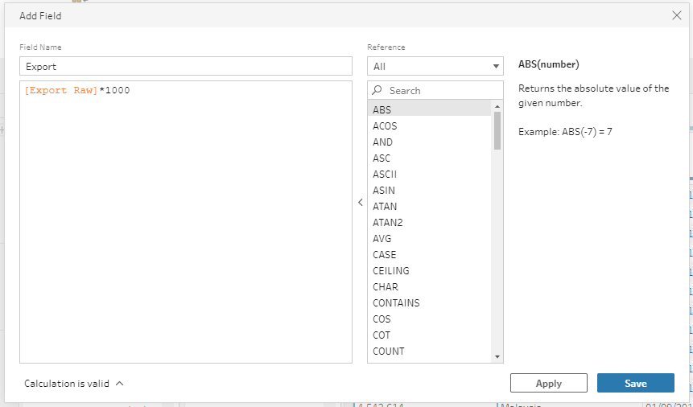

19.	Similarly, click on the ellipsis of Import Raw -> Create Calculated Field -> Custom Calculation. Create a new filed ‘Import’ by multiplying the Import Raw by 1000.

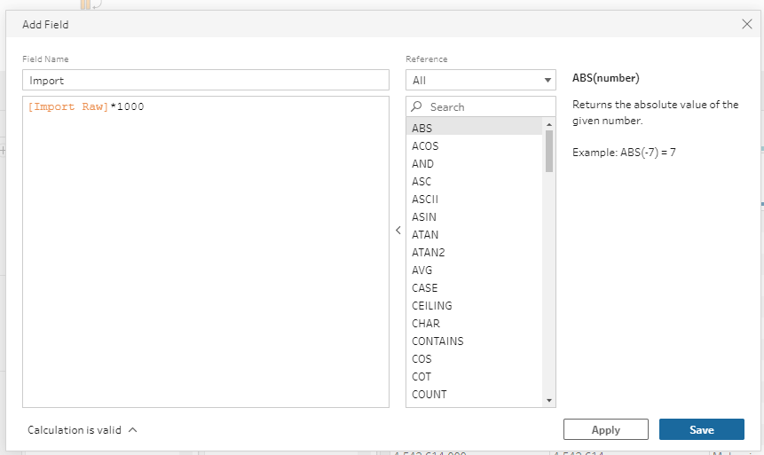
 
20.	Remove ‘Export Raw’ and ‘Import Raw’ and rearrange the column to ‘Date, Country, Export, Import’.

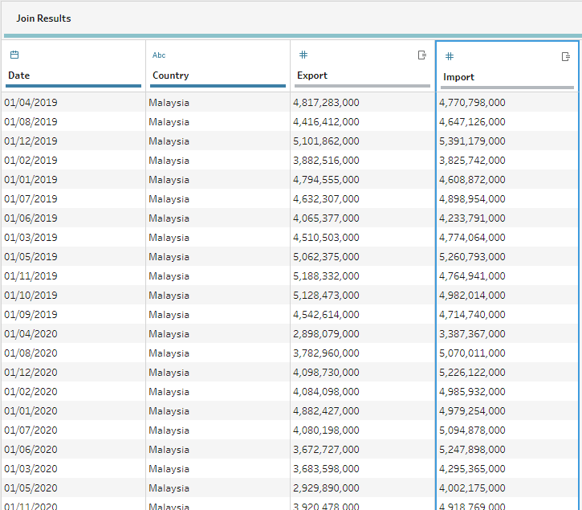{width=80%}

21.	On the data flow diagram, choose the ‘+’ after Join 1 and select ‘Output’.

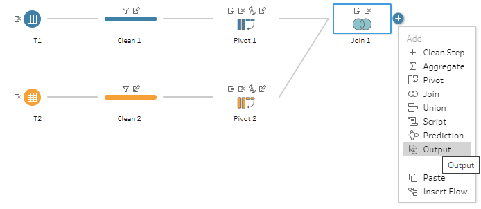

22.	From Output, set the desired location and filename and click ‘Run Flow’ button to save the Tableau Data Extract (**.hyper**) output type.

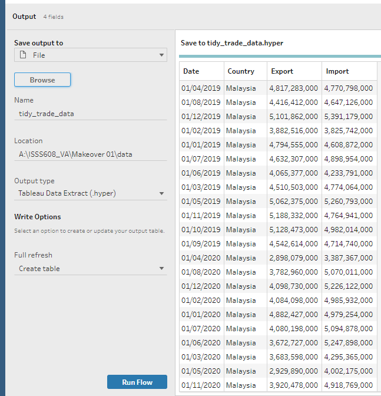{width=80%}

23.	Finally, after completing all the steps for the data preparation, the final data flow should be similar to this:

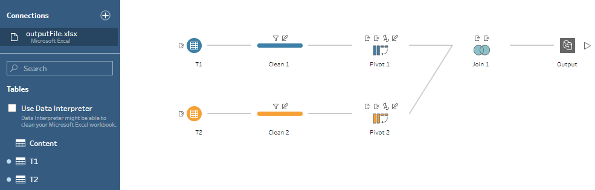
 

_Through data preparation, the raw data has been transformed into a tidy format with only 4 data fields namely Date, Country, Export, and Import which can be easily visualised using Tableau Desktop._


## 4.3 Data Visualisation

1.	Connect the Tableau Data Extract output file (**tidy_trade_data.hyper**) from the data preparation steps to Tableau Desktop.


2.	After successful connection, the Data Source should be similar to this:

{width=80%}
 
3.	On Sheet 1 Data pane, right click on the ‘Export’ -> Create -> Calculated Field and create a new field ‘Total Trade’ using the formula [Export] + [Import].

{width=80%}

{width=80%}

4.	Similarly, create a new field ‘Net Trade’ using the formula [Export] - [Import].

{width=80%}

5.	From Data pane, drag ‘Country’ and ‘Date’ to Columns. Note that ‘Date’ should be in the ‘Month’ and ‘Continuous’ format.

{width=70%}
 
6.	On Data pane, change the date format to be consistent with the raw data source by selecting ‘Date’ -> Default Properties -> Date Format and typing ‘mmm yyyy’ in the Custom option.

{width=70%}

{width=70%}

7.	Drag ‘Total Trade’ and ‘Measure Values’ to Rows.


 
8.	Remove CNT(Extract), SUM(Net Trade) and SUM(Total Trade) from the Measure Values.

{width=40%}
 
9.	From Measure Values on Rows, select Dual Axis.

{width=70%}
 
10.	Right click from the secondary y-axis, select ‘Synchronize Axis’ and uncheck ‘Show Header’ to have only 1 visible synchronized y-axis.

{width=40%}

11.	From the Marks pane, drag ‘Measure Name’ to ‘Color’ both for SUM(Total Trade) and Measure Values.

{width=40%}
 
12.	Choose ‘Edit Colors’ from the ‘Measure Name’ color legends on the right side of the main workspace. 

{width=40%}
 
13.	Select blue for Total Trade, green for Export and Red for Import.

{width=60%}

14.	Edit the Legend Title from ‘Measure Names’ to ‘Legends:’ and rearrange it to Total Trade, Export, and finally Import.

{width=30%}
 
15.	To apply the concept of _visual highlighting_, in the Marks pane, adjust the Size of SUM(Total Trade) to a lower value as shown:

{width=40%}
 
16.	Similarly, adjust the ‘Measure Values’ Size to minimum and ‘Color’ Opacity to 80%.

{width=35%}
 
17.	On the main workspace, right click on the ‘Country’ and Hide Labels for Columns. Afterwards, right click on the x-axis, choose Edit Axis and remove the Title ‘Month of Date’.

{width=40%}
 
18.	Right click on the y-axis, choose Edit Axis and update the Title to ‘Trade Value (S$)’.

{width=50%}
 
19.	On the Analytics pane, drag the ‘Trend Line’ to the main workspace and place it to SUM(Total Trade).


 
20.	Rearrange the main workspace in ascending order of Total Trade by dragging the column header. The order of countries should be Japan, Hong Kong, Taiwan, United States, Malaysia, and Mainland China. 


 

_At this point, *clarity* of the line charts has been established. The succeeding steps will enhance the *aesthetics* by applying the concepts of *data-ink*_.


21.	Right click on the country name and choose Format. Adjust the Default Font to size 10 and Shading to gray as shown below:

{width=60%}
 
22.	Right click on the x-axis Dates and choose Format.  Adjust the Default Shading to a lighter shade of gray as show below:

{width=50%}


23.	Right click on the y-axis and choose Format.  Adjust the Title Font size to 10.

{width=50%}

24.	Right click on the main workspace, choose Format and then select Format Borders. To make trellis display per country move visible, adjust the Column Divider more as follows:

{width=60%}

25.	To make the Trade Value tick marks less prominent, adjust the Row Divider as follows:

{width=60%}

26.	Rename Sheet 1 to ‘Total Trade’. Copy and paste to a new sheet and rename it to ‘Net Trade’.

{width=40%}

27.	In the Net Trade sheet, remove the SUM(Trade Total) and Measure Values from Rows and drag Net Trade to replace it.


 
28.	From the Marks pane, change the chart type to Bar and drag ‘Net Trade’ to Color.


 
29.	From the SUM(Net Trade) legend, click Edit Colors. Adjust the Palette to red and green using the same color hex value of Import and Export chart line from Total Trade sheet. Set the Stepped Colors to 2 and set the Center to 0. 

{width=80%}
 
30.	The bar chart of the Net Trade should be similar to this:


 
31.	For both Total Trade and Net Trade sheets, adjust the view to ‘Entire View’.

{width=40%}
 
32.	Create a new dashboard with Fixed size A4 Landscape (1169 x 892). This size is chosen because the data visualisation must be in **static form** and therefore easier to print.

{width=40%}

33.	Drag Vertical object to the main workspace.

{width=40%}
 
34.	Drag ‘Text’ object and type the title of the graph with font size 14.

{width=50%}
 
35.	Drag another Text object and type the subtitle of the graph with font Tableau Regular and font size 10.

{width=50%}
 
36.	Drag Vertical object and place the ‘Total Trade’ sheet.


37.	The sheet title ‘Total Trade’ is taking to much space. Right click on the title and select ‘Hide Title’. It will be replaced by Text object.

{width=50%}
 
38.	Drag Vertical object and place the ‘Net Trade’ sheet.


 
39.	Hide the Net Trade title and replace with Text object.

{width=50%}
 
40.	Adjust the height of the Total Trade and Net Trade. Net Trade should be almost half of the Total Trade since its range is from -2B to 4B compared to 0B to 14B range of Total Trade.


41.	Adjust the background of Title and graph title to make it more visible.


42.	Add a thin border to the graph and set the inner padding to 4.


 
43.	Adjust the y-axis title of Net Trade to ‘Net Trade (S$) and Net Trade Legends to ‘Net Trade: (-) Import   (+) Export. Additionally, adjust the Total Trade legend title to ‘Trade Types:’


 
44.	Right click on the Total Trade and Net Trade graphs and add Area _annotations to tell some interesting data stories_.


45.	Add the data source and write up blog hyperlinks by creating new calculated fields and new sheets ‘Source Link’ and ‘Web Link’. This [reference](https://www.thedataschool.co.uk/tom-pilgrem/how-to-add-hyperlinks-to-your-dashboards/) provides detailed steps on how to create the hyperlinks in Tableau. 


 
46.	Finally, add the data source and write up hyperlinks at the bottom of the dashboard.


# 5.0 Derived Insights

## 5.1 Total Trade Trends

Based on the Total Trade linear trend, the trade with Japan is relatively consistent with minimal fluctuations. The total trades with United States and Malaysia are on downward trend. Nevertheless, the total trades with Hong Kong, Taiwan and Mainland China are on upward trend.

## 5.2 Net Trade Insights

Based on the Net Trade bar chart, Hong Kong is the top net exporter while Taiwan is the top net importer. Additionally, the value of exports exceeds imports for Singapore's merchandise trade with Mainland China. The value of imports exceeds exports for Singapore's trade with Japan, United States, and Malaysia. These observations were also verified by [SingStat infographics](https://www.singstat.gov.sg/modules/infographics/singapore-international-trade).

## 5.3 Significant Events

Based on the line charts and bar graph, there are interesting data stories that maybe correlated to significant events of 2020 COVID-19 pandemic. 

*	Trade with Malaysia significantly dropped on Apr 2020 which coincided with the start of [Singapore's circuit breaker period](https://www.channelnewsasia.com/news/singapore/covid-19-circuit-breaker-chronicles-charting-evolution-12779048).

*	Trade with Mainland China significantly dropped on Feb 2020 around the same period when [Chinese government imposed major restrictions](https://www.china-briefing.com/news/china-covid-19-policy-tracker-benefiting-business-enterprises-comprehensive-updated-list/).

*	Trade with US reversed from net importer to net exporter on Apr 2020 around the period after [WHO declared COVID-19 as global pandemic](https://www.who.int/director-general/speeches/detail/who-director-general-s-opening-remarks-at-the-media-briefing-on-covid-19---11-march-2020).

*	Mainland China become net exporter from Aug 2020 around the time when [China's economic recovery gained speed](https://www.marketwatch.com/story/chinas-economic-recovery-gained-speed-in-august-2020-09-14).

_Note though that these correlations with significant events do NOT imply causation on Singapore’s International Trade. There are many micro- and macro-economic factors that should be taken into consideration to fully understand the dynamics of international trades._

