```{r setup, include=FALSE}
knitr::opts_chunk$set(echo = FALSE)
```

# 1.0 Critique of Visualisation

The original visualisation can be seen below:


Generally, the graph is beautiful but confusing. The use of bubble size to indicate the total merchandise trade is a good initial step. Nonetheless, there are plenty of areas to improve with regards to clarity and aesthetics of the graph as discussed below:

## 1.1	Clarity

1.	**Title**: The title of the graph is vague. It mentions ‘Merchandise Trade Performance with Major Trading Partners’. However, there are no qualifiers for the ‘Performance’ and ‘Major’ - does ‘performance’ mean total trade (import + export) and ‘major’ mean Top 10 trading partners?

2.	**Axis**: The position of countries as net exporter or net importer is confusing. In particular, it is difficult to determine the centre point (white circle) for the bubbles of Malaysia, EU, Japan Republic of Korea - whether they are within the net importer blue region or net exporter green region. Additionally, the diagonal separation of net importer region and net exporter region is not intuitive.

3.	**Proportionality**: The total trade per trading partner is not geographically proportional. European Union comprises of several countries namely Austria, Belgium, Bulgaria, Croatia, Cyprus, Czech Rep, Denmark, Estonia, Finland, France, Germany, Greece, Hungary, Ireland, Italy, Latvia, Lithuania, Luxembourg, Malta, Netherlands, Poland, Portugal, Romania, Slovak Rep, Slovenia, Spain, and Sweden while Hong Kong is special administrative region of Mainland China. These trading partners are then compared against individual countries.

4.	**Visibility**: The size and color of bigger bubbles obstruct the view of other smaller bubbles. For example, United States blocks the bubble of EU and Malaysia while Japan blocks the bubble of Republic of Korea.

5.	**Interactivity**: Aside from zooming effect of bubbles, no additional information is provided when the mouse is hovering the country. 

## 1.2	Aesthetic

1.	**Color**: The use of different colors for each trading partner does not provide additional information and can cause misinterpretation. For example, the green color of Malaysia bubble may be associated with net exporter green region which is not the case – looking at the centre point of Malaysia, it is positioned towards net importer region. Additionally, the use of solid color (opacity = 100%) blocks the information of smaller bubble size. 

2.	**Legend**: The note at the bottom of the graph which serves as a legend is too wordy. It is not easy to understand how the color of the background is associated with net import and net export regions.

3.	**Axis**: Both the x and y axes for net exporters and net importers do not include the unit of measurement which should be in billion Singapore dollars (S\$0 to S\$ 80B).

4.	**Subtitle**. The graph does not have subtitle which can be used to convey intent and additional information. It also does not include annotations to tell interesting data stories.


# 2.0 Alternative Design

The proposed alternative design leverages on the good qualities of the original visualisation. It keeps bubble graph corresponding to the total merchandise trade value, green color for net exporter and blue color for net importers. Additionally, the design will preserve the ‘ Top 10 Major Trading Partners’ but present it in another way using slopegraph.

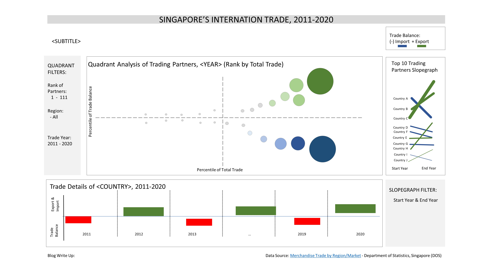

With reference to the critiques previously mentioned, the following suggestions are proposed:

## 2.1 Clarity
1.	**Title**: The title of the graph is updated to SINGAPORE’S INTERNATIONAL TRADE FROM ALL REGIONS, 2011-2020 to showcase the scope of visualization both in number years and trading partners included.

2.	**Axis**: The position of trading partners will be plot against a quadrant where x-axis is the percentile of total trade and y-axis is the percentile of trade balance. The 4 quadrants can clearly show which countries are among the top exporter, top importers and biggest trading partners in terms of total trade.

3.	**Proportionality**: The visualization of trade will be done on individual trading partners instead of regional block (example: European Union). Nevertheless, an additional filter is added to select countries from certain regions (example: Africa, Americas, Asia, Europe, Ocenia).

4.	**Visibility**: Opacity is set to 80% and border is added to prevent bigger bubbles from blocking the smaller bubbles.

5.	**Interactivity**: Interactivity is enhanced using filters to control the information shown on the quadrant and slopegraph. For the quadrant, users can select how many trading partners, from which region and what year will be shown in the animated bubble plot. For the slopegraph, users can select the start and end year and see how the Top 10 trading partners change over the period. To show the trade details of a particular country, user can click on any country from quadrant or slopegraph. Afterwards, export, import and trade balance will be plotted from 2011-2020. Additional information is shown when hovering the trading partner names including the ranks, total trade, trade balance, export, import and effective date 

6.	**Animation**: Animation is added to effectively show the transitions or changes in ranks, size and distribution of different trading partners.

## 2.2 Aesthetic

1.	**Color**: The color is updated to correspond to the trade balance. Blue is use for net importers while green is used for net exporters. This color scheme is consistent with the original visualisation where net importers and net exporters are marked by green and blue regions respectively. Additionally, the size of bubbles for quadrant and thickness of the line for slopegraph corresponds to the total trade of each trading partners. 

2.	**Legend**: The color legend is added beside the subtitle so user can read it quickly and have an idea what the 2 colors mean.

3.	**Axis**: The axis is updated to percentile of total trade and percentile of trade balance for quadrant analysis. For both slopegraph and trade details, the x-axis is set to trading date.

4.	**Subtitle**. Subtitle is added to convey additional information. Data source is also included to cite Department of Statistics, Singapore.

5.	**Layout**.  The layout utilizes the coordinate views for linked and multi-dimensional exploration. Users can start with the overview explorations of quadrant analysis by changing the number of trading partners shown, region and year of interest. The animation from quadrant may not explicitly show the ranking of trading partners, the slopegraph can supplement how the top trading partners change over the years. The user can also perform detailed exploration by selecting the name of trading partner from quadrant and slopegraph graphs. 

# 3.0 Proposed Data Visualisation

The proposed data visualisation can be seen below and available on Tableau Public through this [link](https://public.tableau.com/app/profile/adolit/viz/DataViz_Makeover02/SGTradeDashboard).

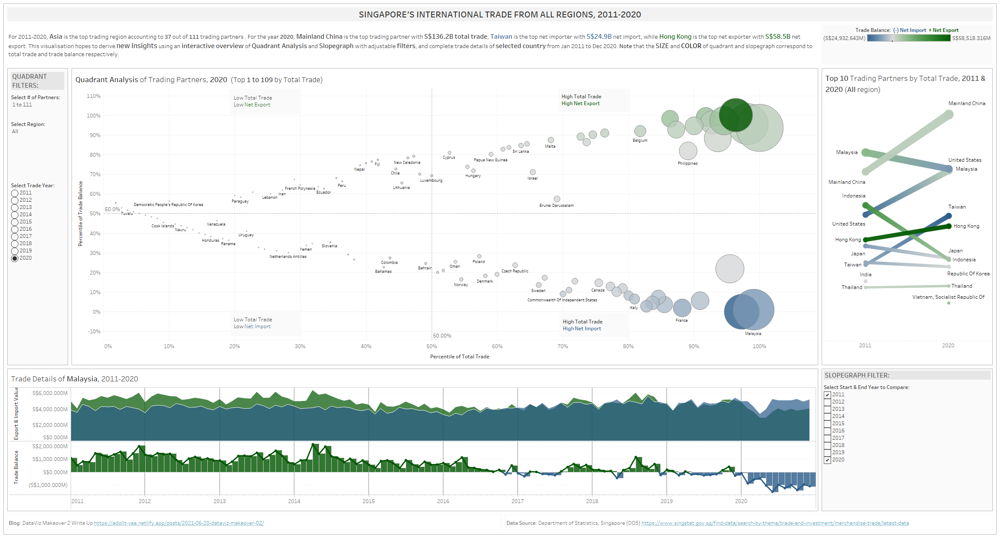

# 4.0	 Step-by-step Guide

## 4.1 Data Understanding

The data is available from [Merchandise Trade by Region/Market](https://www.singstat.gov.sg/find-data/search-by-theme/trade-and-investment/merchandise-trade/latest-data) and can be downloaded by clicking on the link ‘Download all in Excel’ on the same webpage. The file (**outputFile.xlsx**) consists of 3 sheets - Content, T1 which contains merchandise imports, and T2 which contains merchandise exports. The document includes merchandise trade information for more than one hundred countries and regions starting from Jan 1976 up to the present. 

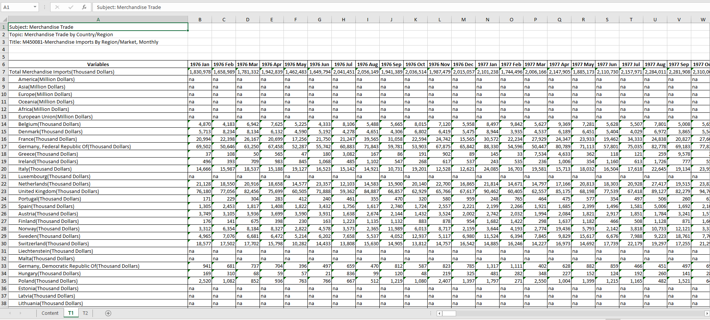 

For this makeover, all trading partners will be included except for the aggregate value of different regions (America, Asia, Europe, Oceania, Africa and European Union) will be excluded to maintain the same geographical proportional. Additionally, the visualisation is limited to the period of Jan 2011 to Dec 2020.

## 4.2 Data Preparation

**#** | **Step** | **Reference Image**
-|-----|--------
P1| Download the file from [SingStat]((https://www.singstat.gov.sg/find-data/search-by-theme/trade-and-investment/merchandise-trade/latest-data)) website, unzip it, connect the Excel file (outputFile.xlsx) to Tableau Prep Builder and select “Cleaned with Data Interpreter”|{width=100%} 
P2|	Drag T1 to the main pane, select rows corresponding to the Variables, 2011, 2012, 2013 until 2020 using the search function|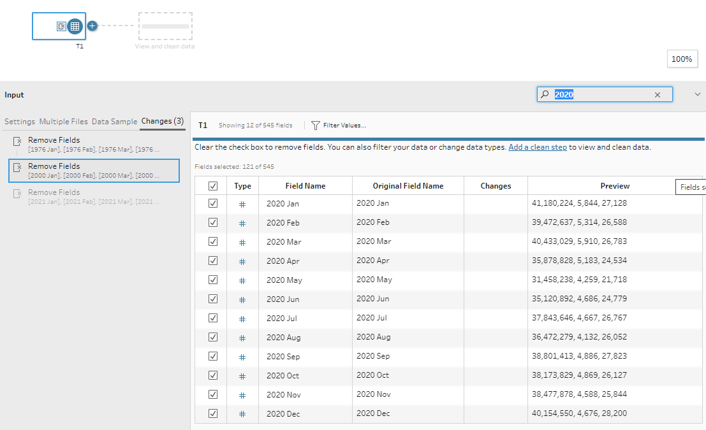{width=100%} 
P3|	Add “Clean” step, Filter: Selected Values, search for “Total”, “Million” and exclude these rows|{width=100%} 
P4|	Select Variables column, click on the “Automatic Split”|{width=100%} 
P5|	Delete Variables – Split 2 and Variables|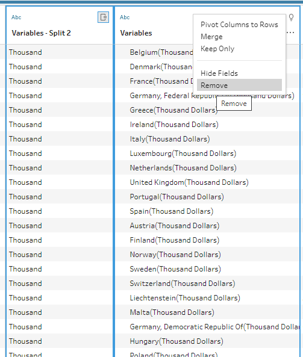{width=100%} 
P6|	Add a “Pivot” step and drag Jan 2011 to Dec 2020 to the Pivoted Fields|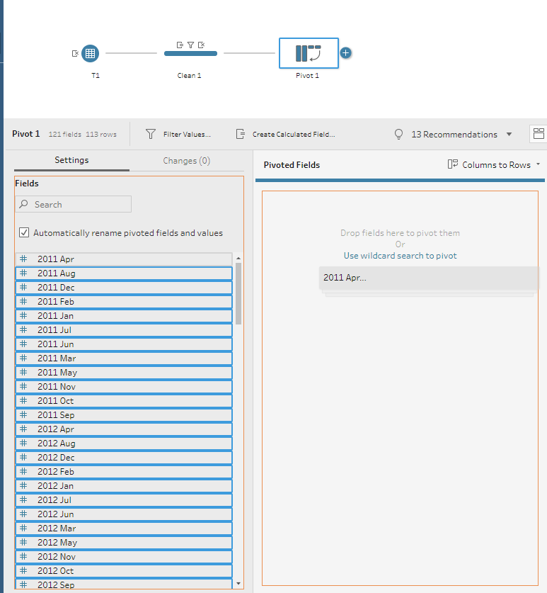{width=100%} 
P7|	Rename “Pivot 1 Names” to “Date”, “Pivot1 Values” to “Import Raw” and “Variables – Split 1” to “Trading Partner|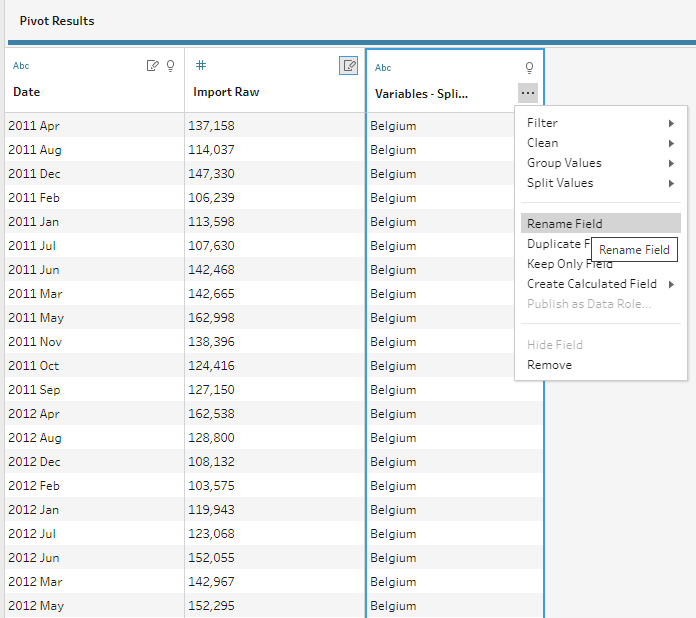{width=100%} 
P8|	Repeat the same steps P2 to P7 for the T2 sheet.  However, in P7, rename “Pivot1 Values” to “Export Raw”|{width=90%} 
P9|	Drag Pivot 2 towards Pivot 1 and create a Join step with settings Pivot 1 Trading Partner = Pivot 2 Trading Partner and Pivot 1 Date = Pivot 2 Date|{width=100%} 
P10|	Click on the blue shaded region to investigate the cause of the mismatch. |{width=90%} <br> _Based on initial analysis, there are 3,360 entries from the T1 (merchandise imports) which cannot be matched in T2 (merchandise exports). For certain trading months, Singapore is importing from these 28 trading partners but not exporting at the same time which can lead to trade balance deficit._
P11|Create a “Export” calculated field by multiplying “Export Raw” by 1000. Similarly, create “Import” calculated field by multiplying “Export Raw” by 1000| 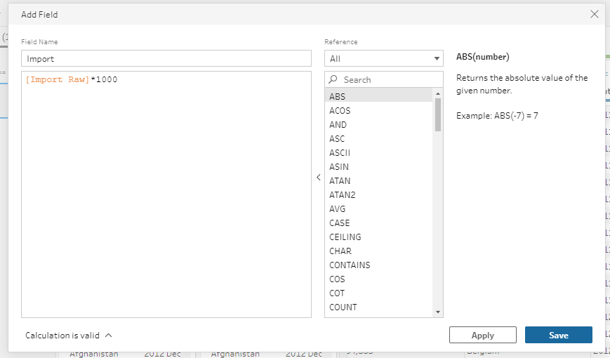{width=100%} 
P12|	From the Join Results, remove the fields “Date – 1”, “Trading Partner – 1”, “Export Raw” and “Import Raw” |{width=100%} 
P13|	Download the “continents2.csv” from [Kaggle](https://www.kaggle.com/andradaolteanu/country-mapping-iso-continent-region) website to map the trading partners (countries) to region (continent)| 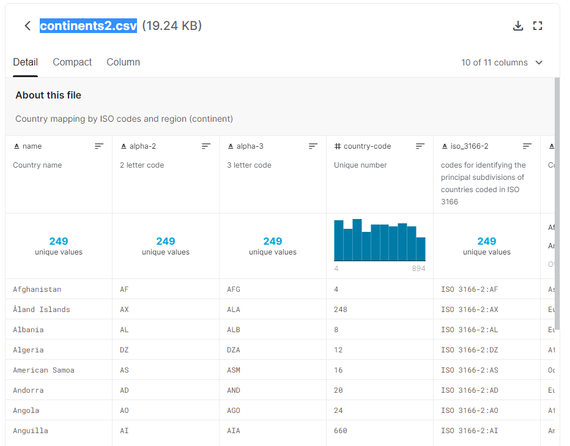{width=100%} 
P14|	Connect “continents2.csv” to Tableau Prep Builder and drag continents2 toward Join1 and create Join 2 with settings Join 1 Trading Partner = Join 2 name|{width=100%} 
P15|	Investigate the cause of the mismatch and update the continents2 name to match the Join 1 Trading Partner|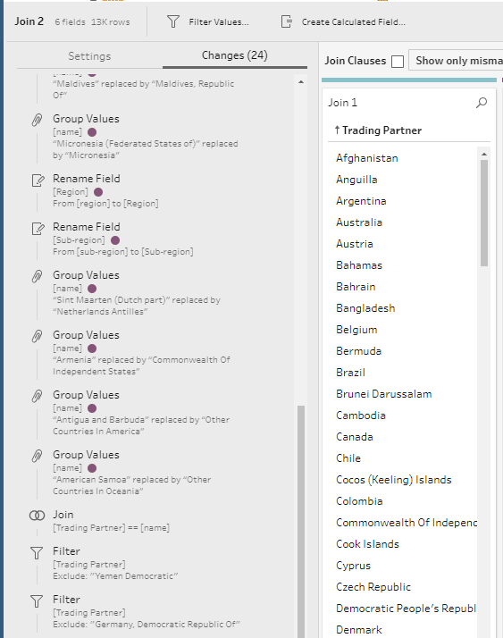{width=100%} <br> _During the data clean up, “Yemen Democratic” and “Germany, Democratic Republic” of were excluded since these are old country names are no trades from 2011 to 2020. “Commonwealth of Independent States” was mapped to “Armenia”; “Other Countries in America” was mapped to “Antigua and Barbuda” and “Other Countries in Ocenia” was mapped to “American Samoa”._
P16|From the Join Results, remove other fields from continent2 except for “region” and “sub-region”|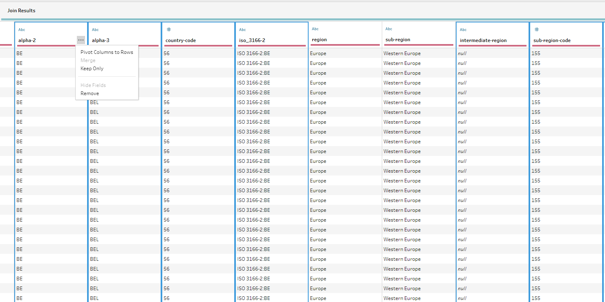{width=100%} 
P17|Add Output node and save the file as tidy_trade_data_makeover2.hyper|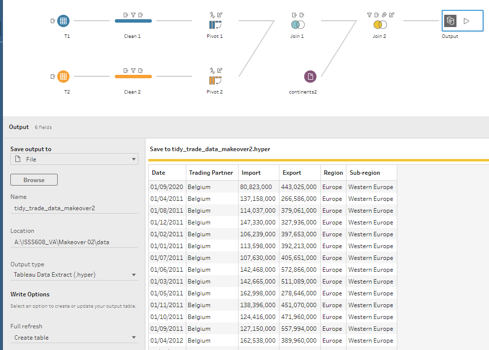{width=100%} 

## 4.3 Data Visualisation
**#** | **Step** | **Reference Image**
-|-----|--------
V1|	Connect tidy_trade_data_makeover2 Extract to Tableau Desktop | 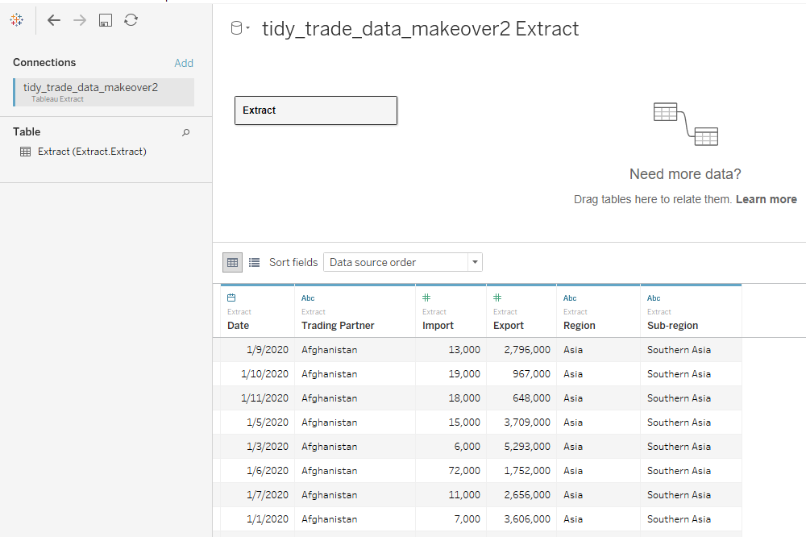{width=90%} 
V2|	Create “Net Trade” calculated field by getting the difference of “Export” and “Import”. | 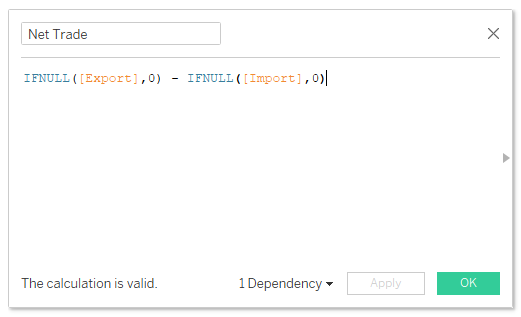{width=100%} 
V3|	Create “Total Trade” calculated field by getting the sum of “Export” and “Import”.| {width=100%} 
V4|	Drag “Total Trade” to Columns, “Net Trade” to Rows and set “Trading Partners” to Details and “Net Trade” to Color in the Marks Pane.| 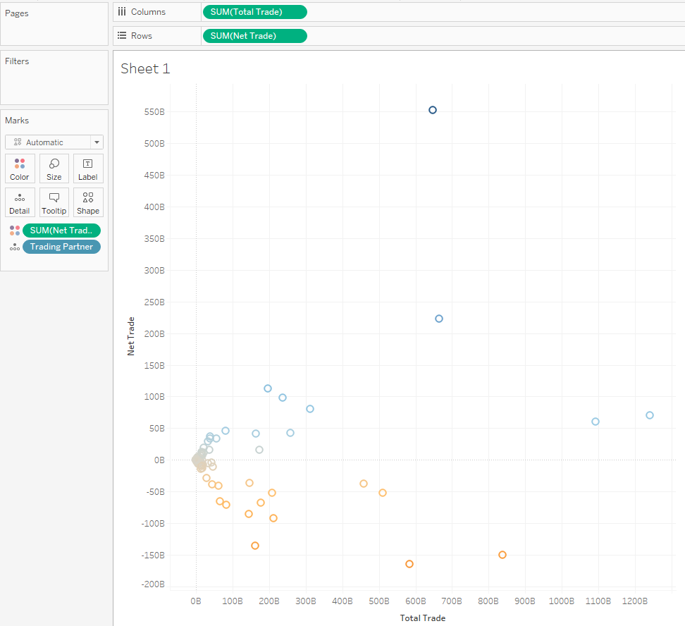{width=90%} 
V5|	Change the “Total Trade” and “Net Trade” settings to Quick Table Calculation -> Percentile| {width=100%} 
V6|	Update the calculation to Compute Using -> “Trading Partners”. | {width=100%} 
V7|	Adjust the color opacity to 80% and negative value to blue and positive to green.| {width=100%} 
V8|	Drag “Total Trade” to Size and set the Graph to “Circle”| 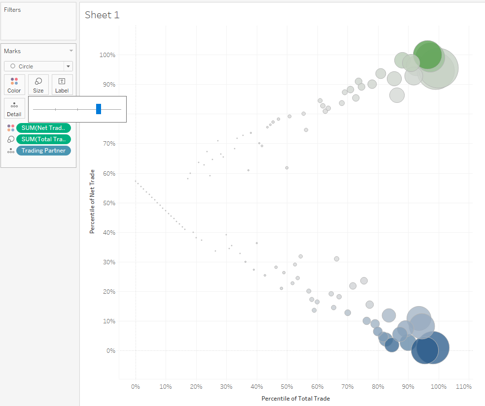{width=100%} 
V9|	Create 6 new calculated fields namely:<br>1) Net Exporter <br>2) Net Importer <br>3) Net Trade Label <br> 4) Rank by Net Exporter <br> 5) Rank by Net Importer <br>6) Rank by Total Trade <br>The formulas are shown on the reference figures. | 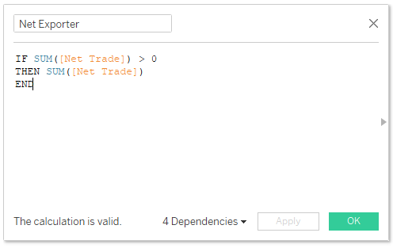{width=100%} <br>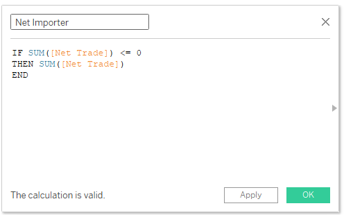{width=100%}  <br>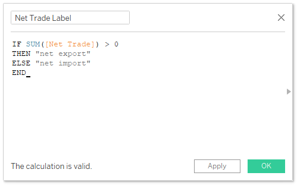{width=100%}  <br>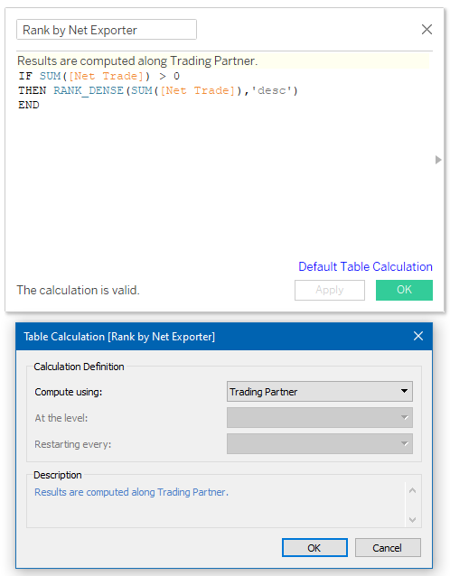{width=100%}  <br>{width=100%} <br>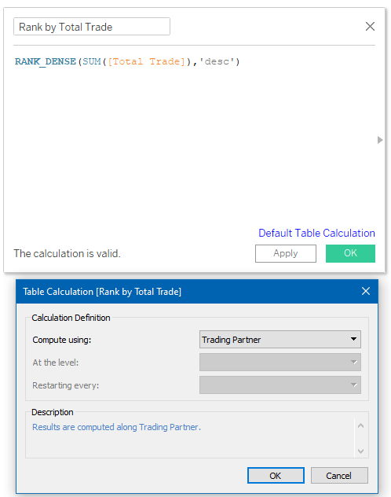{width=80%}
V10|	Drag the 6 new calculated fields to the Tooltip of the Marks pane | 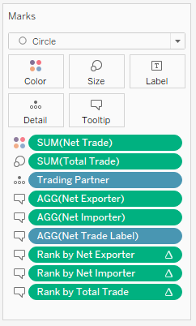{width=50%} 
V11|	Adjust the Tooltip to highlight name, total trade, net trade and ranks as shown on the reference figure. |{width=100%} 
V12|	Add a 50% percentile reference line with dash line format on both x and y axes | 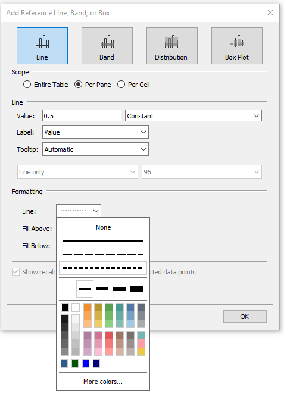{width=100%} 
V13|	Drag the “Date” to Filters pane, Show Filter and set to Discrete. | {width=100%} 
V14|	Adjust the YEAR(DATE) filter and uncheck “Show All Value” and set to “Single Value (list)”. | 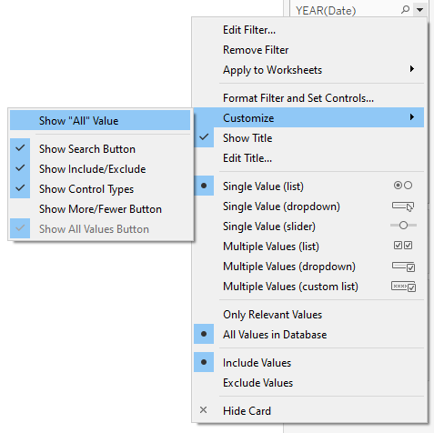{width=100%} 
V15|	Drag “Region” to Filters pane, Show Filter and adjust to “Single Value (list). | 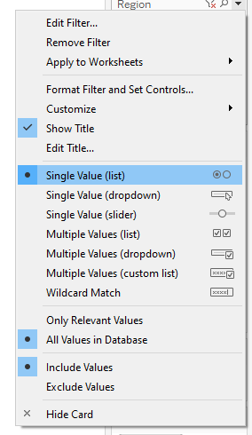{width=100%} 
V16|	Drag “Rank by Total Trade” to Filters pane, Show Filter and adjust to “Range of values”. | 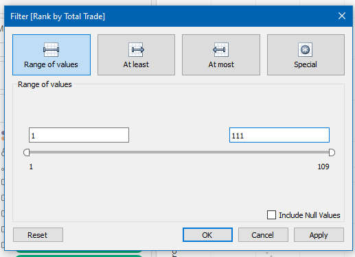{width=100%} 
V17|	Drag “Trading Partners” to “Label” and adjust the font size to 7 and alignment to Bottom | {width=100%} 
V18|	Enable the animation by selecting Format -> Animations. Set the Duration to 1.5 seconds and Style to Sequential. | {width=100%} 
V19|	Edit the title as shown in the reference image and save the sheet as _Bubble Plot_. | 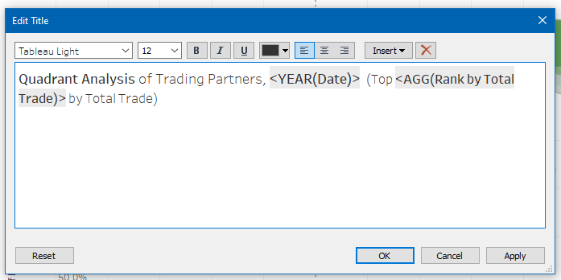{width=100%} 
V20|	In a **new sheet**, drag “Date” to Columns, “Net Trade” and “Total Trade” to Rows and set to “Dual Axis”.  | {width=100%} 
V21|	For SUM(Net Trade) in the Marks pane, set the graph to Bar chart. | 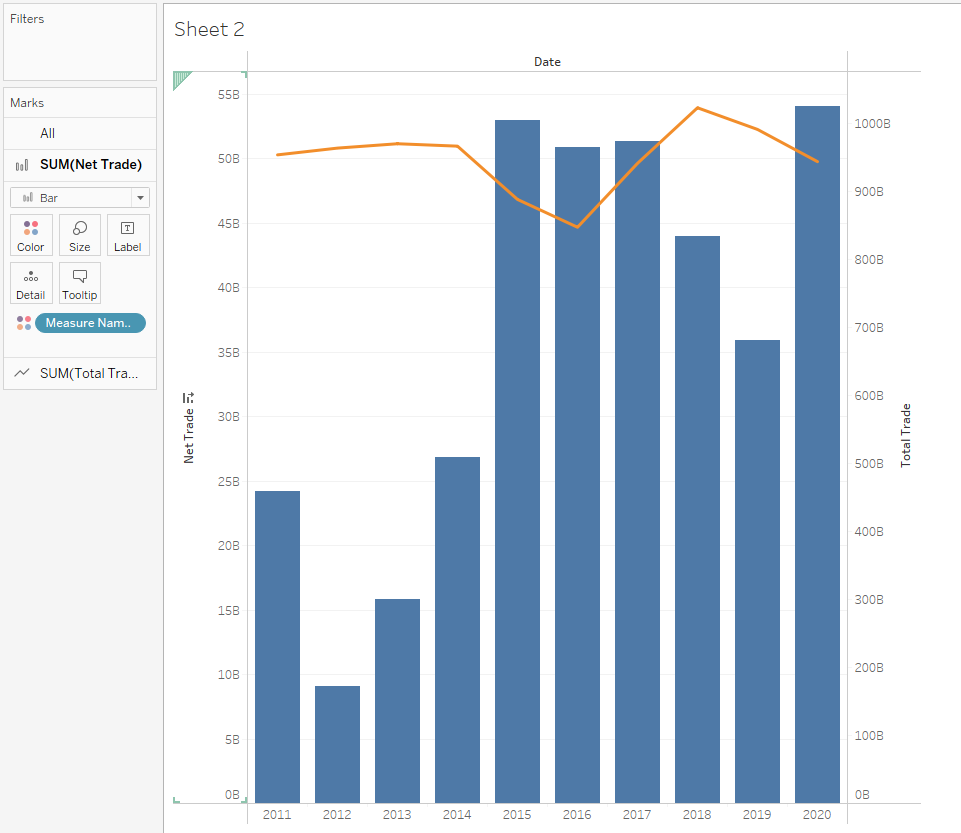{width=100%} 
V22|	Adjust the color and set negative value to blue and positive to green. | {width=100%} 
V23|	For SUM(Total Trade) in the Marks pane, set the graph to Line chart. | {width=100%} 
V24|	Adjust the y-axis of Total Trade to gold to match the color of the line chart. | 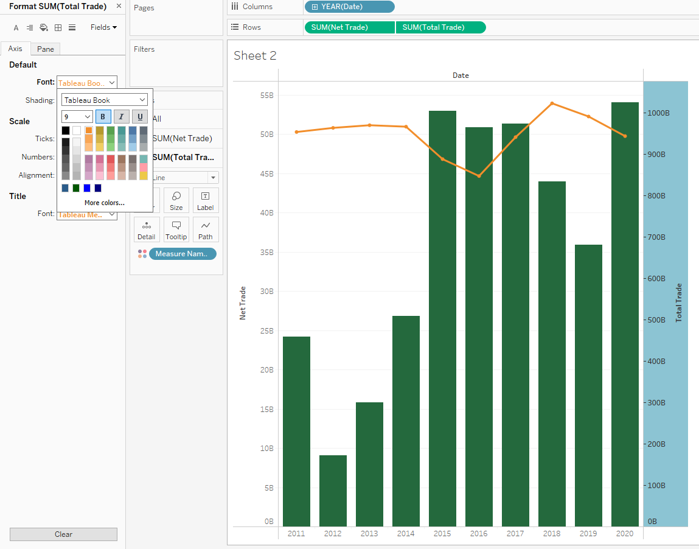{width=100%} 
V25|	Rotate the x-axis label and adjust the size of the graph to make it as small as possible while maintaining the details. Save the sheet as _Annual Bar and Line_.| 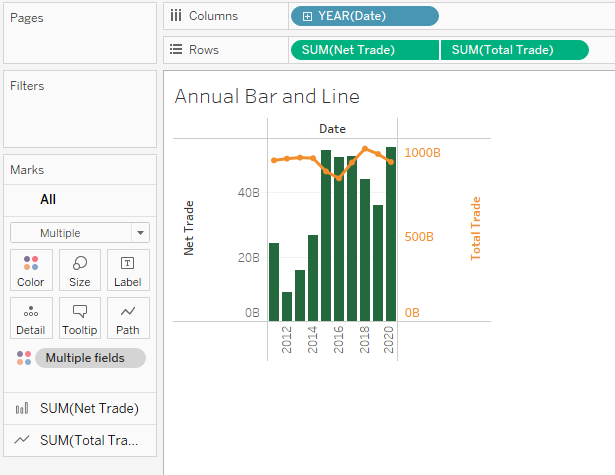{width=100%} 
V26|	In the Bubble Plot Tooltip, insert the Annual Bar and Line. | {width=100%} 
V27|	In a **new sheet**, drag “Date” to Columns and set to “Month” and “Continuous”. | {width=100%} 
V28|	Drag “Export” and “Import” to Rows and set to “Dual Axis”. | {width=100%} 
V29|	Drag “Net Trade” two times to Rows and set to “Dual Axis”. | {width=100%} 
V30|	Synchronize the y-axis of “Import” and uncheck the “Show Header” to hide the  second y-axis. | {width=100%} 
V31|	In the Marks pane, change the SUM(Export) and SUM(Import) to “Area” chart. Additionally, set the first SUM(Net Trade) to “Bar” and the second to “Line”. | {width=50%} 
V32|	Adjust the color of the SUM(EXPORT) to green and SUM(IMPORT) to blue with white Border and 70% opacity. | {width=50%} <br> {width=50%} 
V33|	Adjust the color of both SUM(Net Trade) and set negative value to blue and positive to green with 80% opacity. | {width=100%} 
V34|	Drag “Trading Partner”, “Export” and “Import” into the SUM(Export) and SUM(Import) tooltips. | 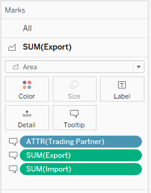{width=50%} 
V35|	Adjust the SUM(Export) and SUM(Import) tooltips to highlight the date, name, export and import of the trading partner as shown by the reference image. | 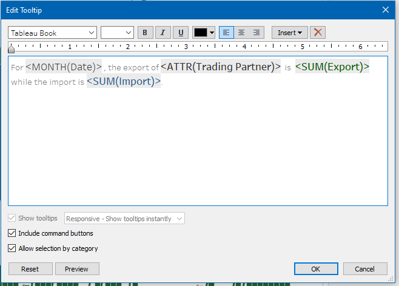{width=100%} 
V36|	Drag “Trading Partner”, “Net Trade Label”, “Net Exporter”, “Net Importer”, “Total Trade” into the SUM(Net Trade) tooltips. | {width=50%} 
V37|	Adjust the SUM(Net Trade) tooltip to highlight the date, name, net export, net import and total trade of the trading partner as shown by the reference image. | 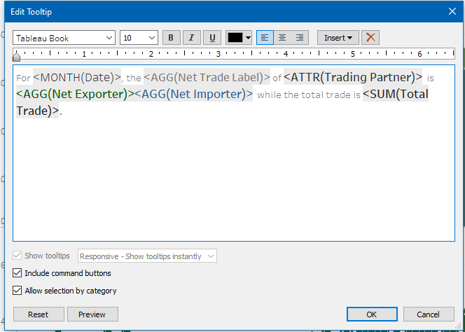{width=100%} 
V38|	Edit the title as shown in the reference image and save the sheet as _Monthly Bar_.| {width=100%} 
V39|	In a **new sheet**, drag “Date” to Columns and “Total Trade” to Rows. | {width=100%} 
V40|	Create a new calculated field “Total Trade End Point” as shown in the reference image. | {width=100%} 
V41|	In the Marks pane, adjust the graph to line. Drag “Trading Partner” to “Details” and “Label” with Label start of line and Label end of line enabled. | {width=100%} 
V42|	Drag “Date” to Filters, Show Filter and uncheck “Show All Value” and set to “Multiple Value (list)”. | 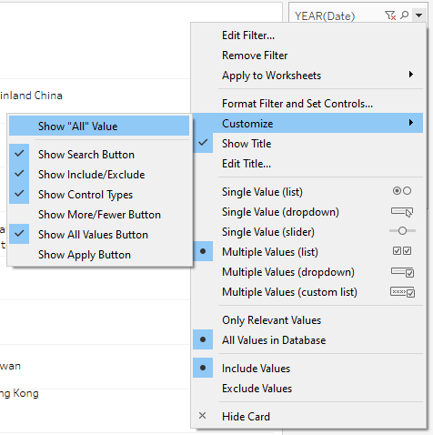{width=100%} 
V43|	Drag “Total Trade End Point” to Filters | {width=100%} 
V44|	Drag “Rank by Total Trade” to Filters and set Range to values to 1 to 10. | 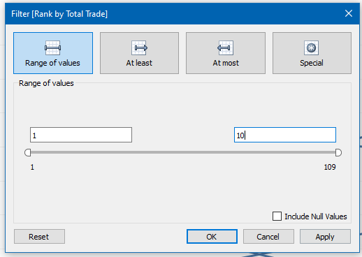{width=100%} 
V45|	Drag Net Trade to Color and Adjust the color opacity to 95% and negative value to blue and positive to green. | {width=100%} 
V46|	Drag “Total Trade” to Size and adjust to middle mark as shown in the reference image| {width=50%} 
V47|	Drag “Net Trade Label”, “Net Exporter”, “Net Importer”, “Rank by Total Trade” into the Tooltip. | 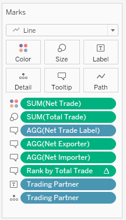{width=50%} 
V48|	Adjust the tooltip to highlight the date, name, net export, net import and total trade of the trading partner as shown by the reference image. | 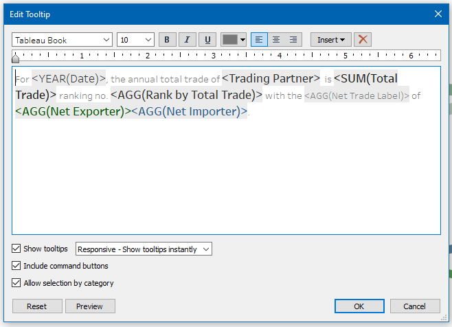{width=100%} 
V49|	Hide the y-axis label by unchecking the “Show Header” and formatting the Columns line to “None” | 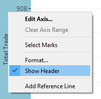{width=50%} 
V50|	Edit the title as shown in the reference image and save the sheet as _Slopegraph_. | 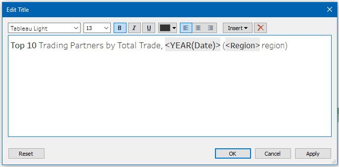{width=100%} 
V51|	For the Bubble Pot, Monthly Bar, and Slopegraph, set the view to “Entire View” | {width=100%} 
V52|	Create a **new dashboard**, set the size to “Automatic” and follow the layout of the proposed design. | {width=100%} 
V53|	Update the filter labels as follows: <br>- “Select # of Partners” from the “Rank by Total Trade” <br>- “Select Region” from “Region” <br>- “Select Trade Year” from “YEAR(Date)” <br>- “Select Start & End Year to Compare” from “YEAR(Date) <br>Unused filters will be removed from the dashboard.  | {width=50%}  <br> 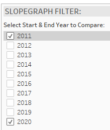{width=50%} 
V54|	In the Dashboard menu, select Action and Add “Filter Action” action as shown in the reference image and save it as “Selected Trading Partner”  | 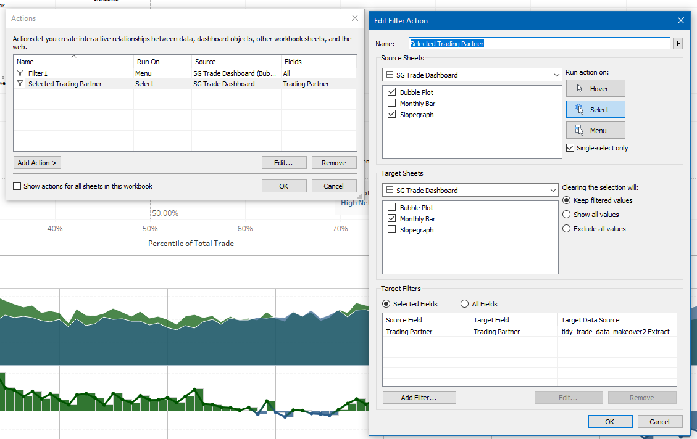{width=100%} 
V55|	Finally, add title, subtitle, annotation in the animated bubble plot, write up and data source reference hyperlinks.  | 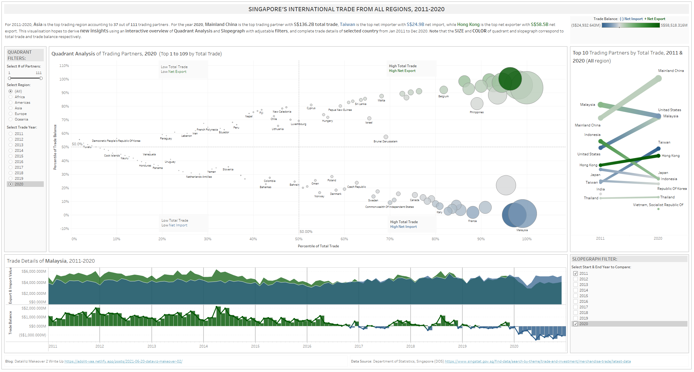{width=100%} 

# 5.0 Derived Insights

## 5.1 Trading Region

For the year 2020, Asia is the top trading region of Singapore accounting to 37 out of 109 trading partners, followed by Europe with 27 trading partners, Americas with 26 trading partners, Oceania with 17 trading partners and lastly Africa with only 2 trading partners.

The 2 trading partners in Africa are French Southern Territories and South Sudan. Even with these 2 partners, the trade is NOT consistent. For example, South Sudan has import of S\$0.25M around April and May 2014 which was only followed by another import of S\$1.443M in Jan 2020.

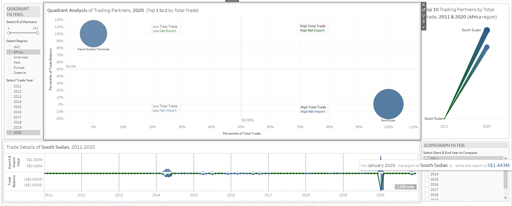

For the Singapore government and companies, it means that there is a huge growth potential in this region, both in terms of import and export, since the little red dot is barely present in the massive African continent.


## 5.2 Top Trading Partners by Total Trade

For 2011 to 2020, the Top 10 trading partners is largely unchanged with Malaysia, Mainland China, Indonesia, United States, Hong Kong, Japan, Taiwan, Republic of Korea and Thailand maintaining their top ranks for over a decade.

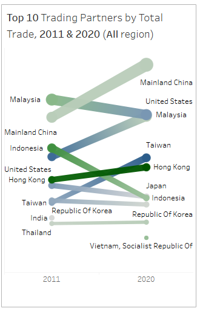{width=50%}

For 2011, the annual total trade of Malaysia is S\$ 113.347B which rank 1. However, it slides to rank 2 in 2020 with lower total trade value of S\$103.450B. Malaysia also transitioned from net exporter in 2011 with a net export of 14.863B to net importer in 2020 with net import of S\$11.649B.

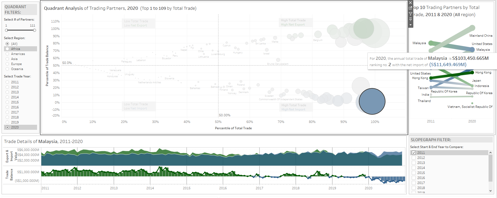{width=100%}

On the other hand, Mainland China rose both in ranking and total trade capturing the top spot in 2020 with a total trade of S\$136.204B up from its runner up position in 2011 with only S\$101.748B total trade.

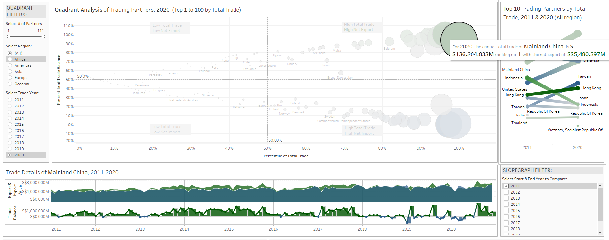{width=100%}

## 5.3 Top Net Exporter and Top Net Importer

In 2020, Taiwan is the top net importer with S\$24.932B net import. Looking back in 2011, Taiwan only ranked no. 7 with net import of S\$8.988B. 

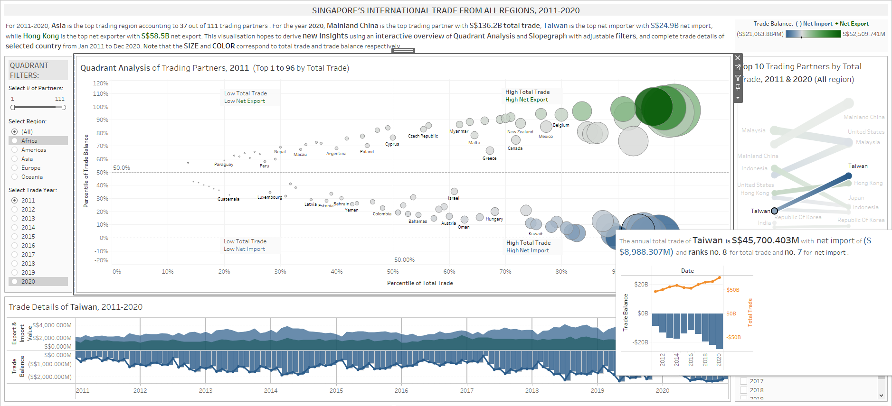{width=100%}

The top importer in 2011 is Saudi Arabia with net import of $S21.063B.

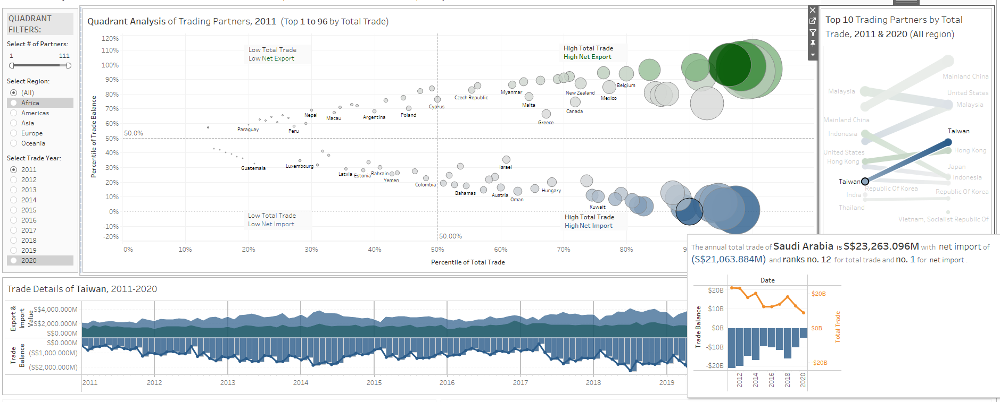{width=100%}

Throughout the decade, Hong Kong has consistently maintained its top net exporter position with S\$52.509B net export in 2011 and S\$58.5B net export in 2020. 

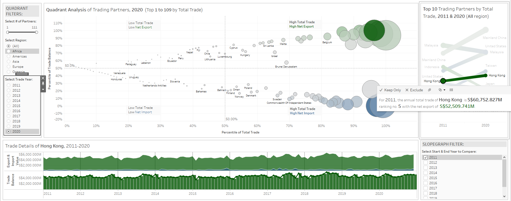{width=100%}