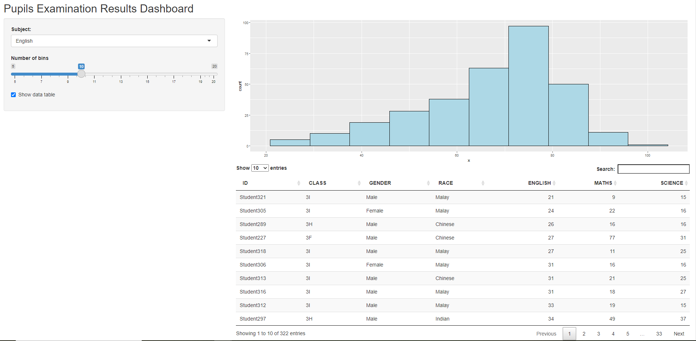

```{r setup, include=FALSE}
options(htmltools.dir.version = FALSE)
knitr::opts_chunk$set(fig.retina=3,
                      echo = TRUE,
                      eval = TRUE,
                      message = FALSE,
                      warning = FALSE)
```

## Shiny: Overview
* Shiny is an open package from RStudio.

* It provides a **web application framework** to create interactive web applications (visualization) called "Shiny apps".

* It can be found at https://shiny.rstudio.com/

## What is so special about Shiny?

It allows R users:

*  to build and share highly interactive web-enabled applications without having to invest significant among of time and efforts to master core web design technologies such as html5, Javascript and CSS.

* to integrate the analytical and visualisation packages of R without having to change from one programming language to another.

## The Structure of a Shiny app

A Shiny app comprises of two components, namely:

* user-interface script, and 

* server script.

### Shiny's user-interface, *ui.R*

The *ui.R* script controls the layout and appearance of a shiny app.

* It is defined in a source script name *ui.R*.

* Actually, *ui* is a web document that the user gets to see, it is based on the famous Twitter bootstrap framework, which makes the look and layout highly customizable and fully responsive.
    
* In fact, you only need to know R and how to use the shiny package to build a pretty web application. Also, a little knowledge of HTML, CSS, and JavaScript may help.

### Shiny's server *server.R*

The *server.R* script contains the instructions that your computer needs to build your Shiny app.

You are expected to:

* know how to program with R.

* familiar with Tidyverse, specifically dplyr, tidyr and ggplot2 

## Building a Shiny app

* A Shiny app can be in a form of a single file called ***app.R***.

* Alternatively, a Shiny app can be also created using separate ***ui.R*** and ***server.R*** files.

* The separate files way is preferred when the app is complex and involves more codes.


## Shiny app example

The preview of Shiny app can be seen below:



The app reads the Exam_data.csv and generate a histogram. The user can select the subject to be displayed, the number of bins for the histogram, and enable/disable the data table.
In this simple Shiny app, we were able to load the dataset, work with *titlePanel*, *sidebarLayout()*, *checkboxInput()*, *plotOutput()*, *dataTableOutput()*, *renderPlot()*, and *renderDataTable()*.

## Shiny app code

The code chunk can be seen below:

```{r, echo=TRUE,eval=FALSE}
library(shiny)
library(tidyverse)

exam <- read_csv("data/Exam_data.csv")

# Define UI for application
ui <- fluidPage(
    titlePanel("Pupils Examination Results Dashboard"),
    sidebarLayout(
        sidebarPanel(
            selectInput(inputId = "variable",
                        label = "Subject: ",
                        choices = c("English" = "ENGLISH",
                                    "Maths" = "MATHS",
                                    "Science" = "SCIENCE"),
                        selected = "ENGLISH"),
            sliderInput(inputId = "bin",
                        label = "Number of bins",
                        min = 5,
                        max = 20,
                        value = c(10)),
            checkboxInput(input = "show_data",
                          label = "Show data table",
                          value = TRUE)
        ),
        mainPanel(
            plotOutput("distPlot"),
            DT::dataTableOutput(outputId = "examtable")
        )
    )
)

# Define server logic required
server <- function(input, output) {
    output$distPlot <- renderPlot({
        #unlist - data contains string
        x <- unlist(exam[,input$variable])
        
        ggplot(exam, aes(x)) + 
            geom_histogram(bins = input$bin,
                           color = "black",
                           fill = "light blue")
    })
    
    output$examtable <- DT::renderDataTable({
        if (input$show_data){
            DT::datatable(data = exam %>%
                          select(1:7),
                          options = list(pageLength = 10),
                          rownames = FALSE)
        }
    })
}

# Run the application 
shinyApp(ui = ui, server = server)
```

# Reference
 - [Lesson 11: Getting to Know Shiny](https://isss608.netlify.app/lesson/lesson11/lesson11-intro_shiny#1)
