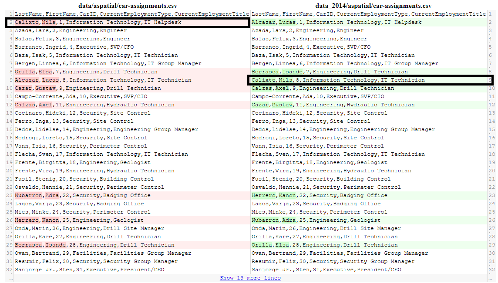
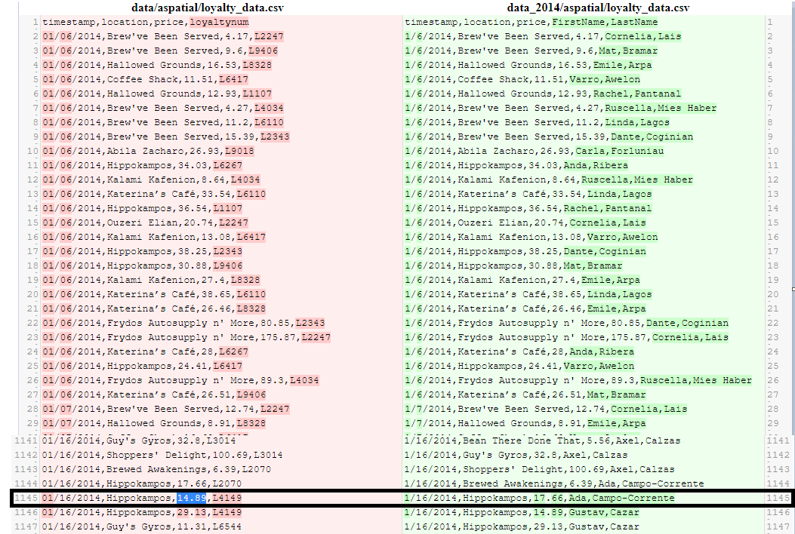
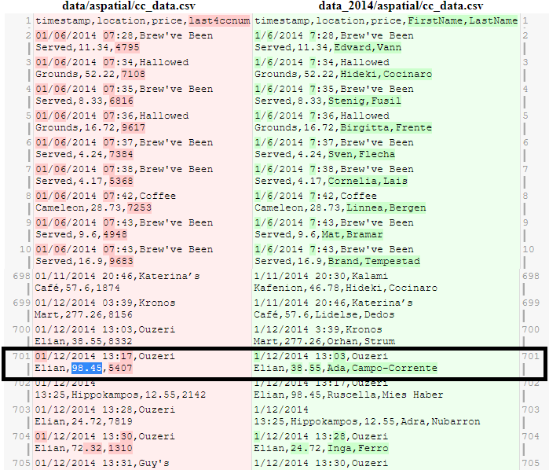
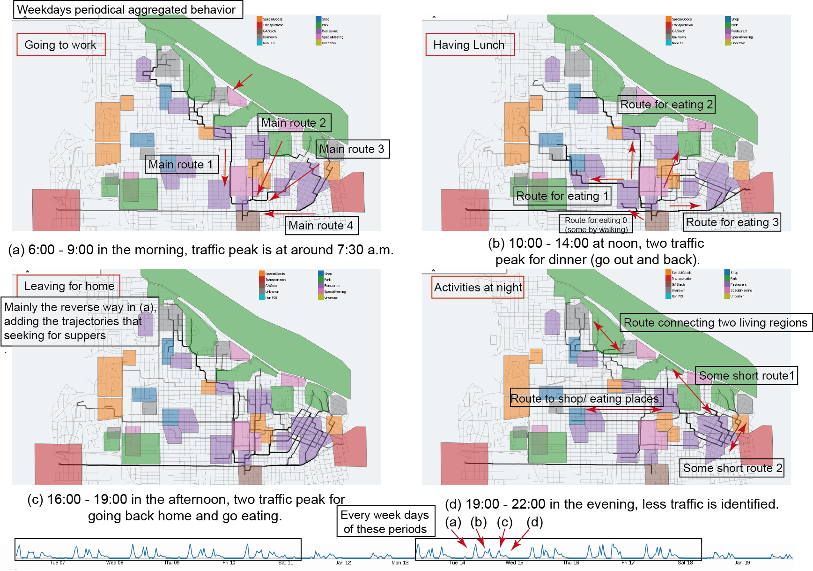
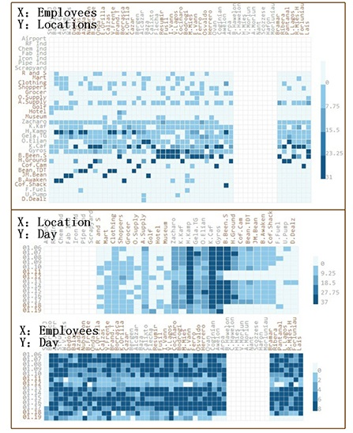
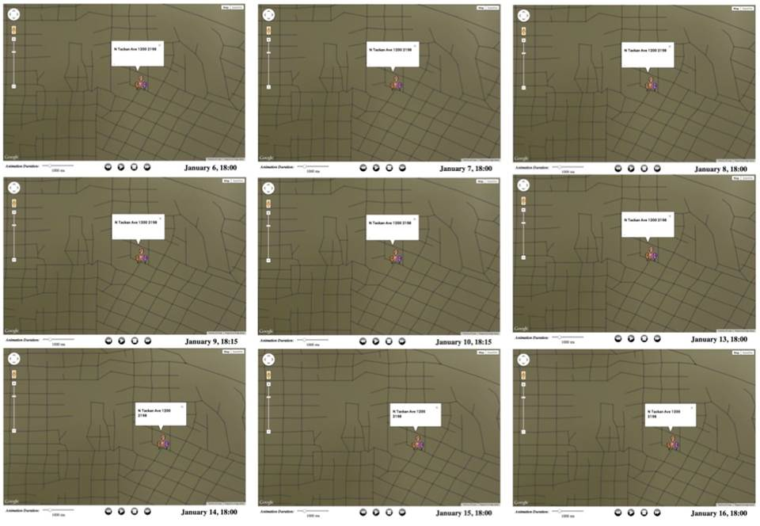
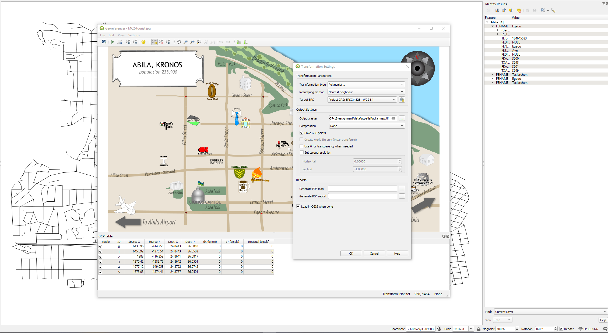

```{r setup, include=FALSE}
options(htmltools.dir.version = FALSE)
knitr::opts_chunk$set(fig.retina=3,
                      echo = TRUE,
                      eval = TRUE,
                      message = FALSE,
                      warning = FALSE)
```

# 1. Overview

The VAST Challenge 2021 is a rerun of the VAST Challenge 2014 with the same story line about the fictitious island country of Kronos, the company GASTech, and the incidents involving missing GAStech employees. However, the data for the VAST Challenge 2021 were modified and new questions were introduced.  

Using the two weeks worth of data leading to the disappearance of the GAStech employees, the goal of [Mini-Challenge 2](https://vast-challenge.github.io/2021/MC2.html) is to analyze the movement and tracking of company vehicles GPS data. Together with GAStech employee’s credit card transactions and Kronos Kares loyalty card data, the main objectives are:

- Identify anomalies and suspicious behaviours

- Identify which people use which credit card and loyalty cards

# 2. Literature Review

## 2.1 Data Understanding

The 2021 data was compared against 2014 data using the _diffr_ package to better understand the variations of VAST Challenge 2021 from the previous year's challenge. 

- **_car-assignments.csv_** contains vehicle assignments by employee. It lists the employee name, Car ID assignment, employee department, and employee job title.

  + Based on the result of code chunk below, all employee names are the same. However, there are 8 employees with different car ID assignment and employee job title. For example, _Calixto,Nils_ was assigned to _CardID 1_ as _IT Helpdesk_ in 2021 challenge but was previously assigned to _CardID 8_ as _IT Technician_ in 2014 challenge.

```{r diff car, eval = FALSE}
library(diffr)
diffr("data/aspatial/car-assignments.csv", "data_2014/aspatial/car-assignments.csv")
```



- **_loyalty_data.csv_** contains the loyalty card transaction data. It lists the date of the transaction, name of the business, price, and the unique 5-character code loyalty number.

  + The major difference in VAST Challenge 2021 is that loyalty number was used instead of employee names. Other minor differences are the date format ( _line:2_ **0**1/**0**6/2014 vs 1/6/2014) and price of transaction ( example: _line:1145_ Hippokampos,**14.89** vs. Hippokampos,**17.66**).

```{r diff loyal, eval = FALSE}
diffr("data/aspatial/loyalty_data.csv", "data_2014/aspatial/loyalty_data.csv")
```



- **_cc_data.csv_** contains the credit and debit card transaction data. It lists the date and time of the transaction, name of the business, price, and last 4 digits of the credit or debit card number.

  + Similar to the loyalty data, the major difference in that last 4 digits was used instead of employee names. Other minor differences are the date and time format ( _line:2_ **0**1/**0**6/2014 07:28 vs 1/6/2014 7:28) as well as the time and price of transaction ( example: _line:701_ 01/12/2014 **13:17**,Ouzeri Elian,**98.45**  vs. 1/12/2014 **13:03**,Ouzeri Elian,**38.5**).


```{r diff cc, eval = FALSE}
diffr("data/aspatial/cc_data.csv", "data_2014/aspatial/cc_data.csv")
```

{width=80%}


- **_gps.csv_** contains the vehicle tracking data. It lists the date and time, car ID, latitude, and longitude coordinates with *685,170* entries. 

  + The file size is too large and it is not practical to do a line by line comparison. Instead of using the _diffr_ , the _md5sum_  from _tools_ package was used to compute the MD5 hashes and detect if there are differences between the 2 files. Based on the result of code chunk below, there are no differences between the 2021 and 2014 gps.csv file.

```{r diff gps}
library(tools)
md5sum("data/aspatial/gps.csv") == md5sum("data_2014/aspatial/gps.csv")
```

- **_MC2-Tourist.jpg_** is the tourist map of Abila, the Capital city of Kronos, with identified location of interest. 

  + Based on visual inspection and _md5sum_ code chunk below, there are no differences between the 2021 and 2014 tourist map.
  
2021 VAST Challenge Map | 2014 VAST Challenge Map
---| ---
{width=95%} |{width=95%}

```{r diff map}
md5sum("data/aspatial/MC2-tourist.jpg") == md5sum("data_2014/aspatial/MC2-tourist.jpg")
```


- **_ESRI shapefiles_** of Abila and Kronos contains the geospatial vector data format for storing geometric location and associated attribute information.

  + Based on the _md5sum_ code chunk below, there are also no differences between the 2021 and 2014 shapefiles.

```{r diff shapefiles, eval = FALSE}
md5sum("data/Geospatial/Abila.dbf") == md5sum("data_2014/Geospatial/Abila.dbf")
md5sum("data/Geospatial/Abila.kml") == md5sum("data_2014/Geospatial/Abila.kml")
md5sum("data/Geospatial/Abila.prj") == md5sum("data_2014/Geospatial/Abila.prj")
md5sum("data/Geospatial/Abila.sbn") == md5sum("data_2014/Geospatial/Abila.sbn")
md5sum("data/Geospatial/Abila.sbx") == md5sum("data_2014/Geospatial/Abila.sbx")
md5sum("data/Geospatial/Abila.shp") == md5sum("data_2014/Geospatial/Abila.shp")
md5sum("data/Geospatial/Abila.shx") == md5sum("data_2014/Geospatial/Abila.shx")

md5sum("data/Geospatial/Kronos Island.kmz") == md5sum("data_2014/Geospatial/Kronos Island.kmz")
md5sum("data/Geospatial/Kronos_Island.dbf") == md5sum("data_2014/Geospatial/Kronos_Island.dbf")
md5sum("data/Geospatial/Kronos_Island.prj") == md5sum("data_2014/Geospatial/Kronos_Island.prj")
md5sum("data/Geospatial/Kronos_Island.sbn") == md5sum("data_2014/Geospatial/Kronos_Island.sbn")
md5sum("data/Geospatial/Kronos_Island.sbx") == md5sum("data_2014/Geospatial/Kronos_Island.sbx")
md5sum("data/Geospatial/Kronos_Island.shp") == md5sum("data_2014/Geospatial/Kronos_Island.shp")
md5sum("data/Geospatial/Kronos_Island.shx") == md5sum("data_2014/Geospatial/Kronos_Island.shx")
```


## 2.2 Guide Questions

VAST Challenge 2014 focuses about 'Patterns of Life' analysis. It asked about the common daily routines of GAStech employees and what does a day in the life of typical GAStech employee look like.  

In contrast, VAST Challenge 2021 asks to infer the owners of each credit card and loyalty card since the employee names were replaced by  last 4 digits of the credit or debit card number and unique 5-character code loyalty number.

Nevertheless, both challenges want to know about _unusual events_, _anomalies_, and _evidences of suspicious activities_.


## 2.3 Visualisation Approaches

By reviewing the submissions for [VAST Challenge 2014](http://visualdata.wustl.edu/varepository/VAST%20Challenge%202014/challenges/MC2%20-%20Patterns%20of%20Life%20Analysis/), several approaches were identified to be relevant to the current VAST challenge and reproducible using R data visualisation and data analysis packages.

Mini-Challenge 2 emphasizes the geospatial-temporal data analysis with the financial data from the credit card and loyalty transactions. The common approach from several submissions was to highlight roadway paths of the car and indicate the position and time relationship. The figure below from the [Peking University](http://visualdata.wustl.edu/varepository/VAST%20Challenge%202014/challenges/MC2%20-%20Patterns%20of%20Life%20Analysis/entries/Peking%20University/), recipient of Excellent Comprehensive Visual Analysis System Award, shows an example geospatial-temporal visualisation.



This example of movement data visualisation can be achieved using _sf_, _raster_, _readr_, _clock_ and _tmap_ packages. It can also be improved by having an interactive map and tooltip information.


The heatmap visualisation below from [Central South University](http://visualdata.wustl.edu/varepository/VAST%20Challenge%202014/challenges/MC2%20-%20Patterns%20of%20Life%20Analysis/entries/Central%20South%20University/), recipient of Outstanding Visualization and Analysis Award, shows the credit card transactions of general staff which can also be used to identify the most popular spots and when they are popular. 
{width=80%}

This example of heatmap visualisation can be achieved using _gglot2_ and _plotly_ packages. It can also be improved by having an interactive tooltip information.


The concept of 'Point of Interest' (POI) from [Virginia Tech](http://visualdata.wustl.edu/varepository/VAST%20Challenge%202014/challenges/MC2%20-%20Patterns%20of%20Life%20Analysis/entries/Virginia%20Tech/), recipient of Effective Presentation Honorable Mention, shows the location with a diameter of 50 meters where an employee stops for more than 5 minutes. The POI concept can be utilized to correlate the gps tracking data, credit and debit card transactions, and loyalty card data to help in identifying the owners of the credit card and loyalty cards.




This example of POI data visualisation can be achieved by reusing the geospatial-temporal packages.


# 3. Methodology


## 3.1 Install and Lauch R Packages

The code chunk below is used to install and load the packages.

```{r r package}
packages = c('ggiraph', 'plotly','lobstr',
             'raster','sf', 'tmap', 
             'igraph', 'tidygraph', 
             'ggraph', 'visNetwork', 
             'lubridate', 'clock',
             'widyr', 'wordcloud',
             'ggwordcloud', 'DT',
             'textplot', 'hms',
             'timetk','tidyverse')

for(p in packages){
  if(!require(p, character.only = T)){
    install.packages(p)
  }
  library(p, character.only = T)
}
```


## 3.2 Import Data

Import the csv files into R using _read_csv()_ of _readr_ package.

```{r import csv}
car_data <- read_csv("data/aspatial/car-assignments.csv")
cc_data <- read_csv("data/aspatial/cc_data.csv")
loyalty_data <- read_csv("data/aspatial/loyalty_data.csv")
gps_data <- read_csv("data/aspatial/gps.csv")

glimpse(car_data)
glimpse(cc_data)
glimpse(loyalty_data)
glimpse(gps_data)
```


Produce a georeference tif file called **abila_map.tif** from the tourist map _MC2-Tourist.jpg_ and _Abila_ shapefiles using an external open-source geographic information system (GIS) software _[QGIS](https://qgis.org/en/site/)_.




Import _abila_map.tif_ into R using _raster()_ of Raster package, 

```{r bgmap}
bgmap <- raster("data/Geospatial/abila_map.tif")

tm_shape(bgmap) +
tm_rgb(bgmap, r = 1,g = 2,b = 3,
       alpha = NA,
       saturation = 1,
       interpolate = TRUE,
       max.value = 255)
```


## 3.3 Prepare Data

- **_car_data_**

There are several employees with the same last name and same first name.
Create a new column _FullName_ and combine _FirstName_ and _LastName_ to have unique employee name identifier using _mutate()_ of _dplyr_ package.

Additionally, rename columns _CurrentEmploymentType_ to _Department_ and _CurrentEmploymentTitle_ to _Title_  using _rename()_. Finally, convert _carID_ field from numerical to factor data type.

```{r prep car}
car_data <- car_data %>%
  #concatenate first and last name
  mutate(FullName = paste(FirstName, LastName, sep = " ")) %>%
  rename(Deparment = CurrentEmploymentType) %>%
  rename(Title = CurrentEmploymentTitle)

car_data$CarID <- as_factor(car_data$CarID)

glimpse(car_data)
```


- **_cc_data_**

_Katerina's Cafe'_ causes error when plotting a graph because of special characters.
Convert the special characters into string format using _mutate()_ and _str_detec()_ functions.

Additionally, convert the _timestamp()_ from character datatype to date-time format using _data-time_parse()_ of _clock_ package, then get the date, day of the week, and hour of transaction.

```{r prep cc}

#detect and replace Katerina to Katerina's Cafe
cc_data <- cc_data %>%
    mutate(location = ifelse(str_detect(location, "Katerina"), "Katerina's Cafe", location))

#convert to date-time format
cc_data$date <- date_time_parse(cc_data$timestamp,
                zone = "",
                format = "%m/%d/%Y")
cc_data$day <- wday(cc_data$date,
                          label = TRUE,
                          abbr = TRUE)

cc_data$timestamp <- date_time_parse(cc_data$timestamp,
                zone = "",
                format = "%m/%d/%Y %H:%M")

cc_data$hour <- get_hour(cc_data$timestamp)

glimpse(cc_data)
```


- **_loyalty_data_**

Similar to _cc_data_, convert the special characters of _Katerina's Cafe'_ into string format, convert the _timestamp_ from character datatype to date-time format, then get the date and day of the week of transaction. Note that _loyalty_data_ does not include the hour and minutes of the transaction.

```{r prep loyal}

#detect and replace Katerina to Katerina's Cafe
loyalty_data <- loyalty_data %>%
    mutate(location = ifelse(str_detect(location, "Katerina"), "Katerina's Cafe", location))

#convert to date-time format
loyalty_data$date <- date_time_parse(loyalty_data$timestamp,
                zone = "",
                format = "%m/%d/%Y")

loyalty_data$timestamp <- date_time_parse(loyalty_data$timestamp,
                zone = "",
                format = "%m/%d/%Y")

loyalty_data$day <- wday(loyalty_data$timestamp,
                          label = TRUE,
                          abbr = TRUE)

glimpse(loyalty_data)
```


- **_gps_data_**

Rename _Timestamp_ to _timestamp_ and _id_ to _CarID_ so it will be consistent with other data frame. 
Similar to  _cc_data_ and _loyalty_data_, convert the _timestamp_ from character datatype to date-time format using _data-time_parse()_, then get the date and day of the week.

Convert _CarID_ field from numerical to factor data type. Lastly, convert the gps data frame into a simple feature data frame using _st_as_sf()_ of _sf_ package.

```{r prep gps}

#rename columns for consistency
gps_data <- gps_data %>%
  rename(timestamp = Timestamp) %>%
  rename(CarID = id)

#convert to date-time format
gps_data$date <- date_time_parse(gps_data$timestamp,
                zone = "",
                format = "%m/%d/%Y")

gps_data$day <- as.factor(wday(gps_data$date,
                          label = TRUE,
                          abbr = TRUE))

gps_data$timestamp <- date_time_parse(gps_data$timestamp,
                zone = "",
                format = "%m/%d/%Y %H:%M:%S")

gps_data$hour <- get_hour(gps_data$timestamp)

#convert to factor data type
gps_data$CarID <- as_factor(gps_data$CarID)


glimpse(gps_data)

#convert to simple feature 
gps_sf <- st_as_sf(gps_data, 
                   coords = c("long", "lat"),
                       crs= 4326)
gps_sf
```


## 3.4 Join Data


- **_financial data_**

Combine the _cc_data_ and _loyalty_data_ based on the purchase information like the location, date and price of transaction using _full_join()_ of _dplyr_ package. 
Exclude _day_ and _timestamp_ from _loyalty_data_ since these fields are redundant with _cc_data_. 
Rearrange the columns into _timestamp, date, day, hour, location, price, last4ccnum, loyaltynum_.

```{r join cc_loyal}

#combine based on date, location, price, exclude day and timestamp
cc_loyalty_data <- full_join(cc_data %>% select(-c("day")),
                             loyalty_data %>% select(-c("day","timestamp")), 
                             by = c("date" = "date", 
                                    "location" = "location", 
                                    "price" = "price"))

#get day of the joint data
cc_loyalty_data$day <- wday(cc_loyalty_data$date,
                          label = TRUE,
                          abbr = TRUE)

#rearrange columns
cc_loyalty_data <- cc_loyalty_data %>%
  select("timestamp", "date", "day", "hour", "location", "price", "last4ccnum", "loyaltynum")

glimpse(cc_loyalty_data)
```
The joint financial data reveals 1,807 entries. Some entries have _last4ccnum_ but without _loyaltynum_, have _loyaltynum_ but without _last4ccnum_. 
Additionally, _last4ccnum_ does not necessarily correpond to only 1 _loyaltynum_ which means the owner may use multiple credit or debit cards for their loyalty card or vice versa.


- **_geospatial data_**

Combine the _car_data_ and _gps_data_ based _CarID_ using _left_join()_ of _dplyr_ package. 
Exclude _FirstName_ and _LastName_ from _car_data_ since these fields are redundant with _FullName_. 

```{r join car_gps}

#combine based on CarID
car_gps_data <- left_join(gps_data, 
                          car_data %>% select(-c("FirstName", "LastName")),
                          by = "CarID")

glimpse(car_gps_data)

car_gps_sf <- left_join(gps_sf,
                        car_data %>% select(-c("FirstName", "LastName")),
                        by = "CarID")

car_gps_sf
```
The joint geospatial data reveals that some _CarID_ cannot be mapped to specific employees. Most probably they are the _truck drivers_ who have no specific car assignment.


Click [**HERE**](https://adolit-vaa.netlify.app/posts/2021-07-26-assignment-2/) to view the _Visual Detective Assignment Part 2_.