```{r setup, include=FALSE}
options(htmltools.dir.version = FALSE)
knitr::opts_chunk$set(fig.retina=3,
                      echo = TRUE,
                      eval = TRUE,
                      message = FALSE,
                      warning = FALSE)
```

```{r r package, echo = FALSE}
packages = c('ggiraph', 'plotly','lobstr',
             'raster','sf', 'tmap', 
             'igraph', 'tidygraph', 
             'ggraph', 'visNetwork', 
             'lubridate', 'clock',
             'widyr', 'wordcloud',
             'ggwordcloud', 'DT',
             'textplot', 'hms',
             'timetk','tidyverse')

for(p in packages){
  if(!require(p, character.only = T)){
    install.packages(p)
  }
  library(p, character.only = T)
}
```

```{r import csv, echo = FALSE}
car_data <- read_csv("data/aspatial/car-assignments.csv")
cc_data <- read_csv("data/aspatial/cc_data.csv")
loyalty_data <- read_csv("data/aspatial/loyalty_data.csv")
gps_data <- read_csv("data/aspatial/gps.csv")
```

```{r bgmap, echo = FALSE}
bgmap <- raster("data/Geospatial/abila_map.tif")
# 
# tm_shape(bgmap) +
# tm_rgb(bgmap, r = 1,g = 2,b = 3,
#        alpha = NA,
#        saturation = 1,
#        interpolate = TRUE,
#        max.value = 255)
```

```{r prep car, echo = FALSE}
car_data <- car_data %>%
  #concatenate first and last name
  mutate(FullName = paste(FirstName, LastName, sep = " ")) %>%
  rename(Deparment = CurrentEmploymentType) %>%
  rename(Title = CurrentEmploymentTitle)

car_data$CarID <- as_factor(car_data$CarID)
```

```{r prep cc, echo = FALSE}

#detect and replace Katerina to Katerina's Cafe
cc_data <- cc_data %>%
    mutate(location = ifelse(str_detect(location, "Katerina"), "Katerina's Cafe", location))

#convert to date-time format
cc_data$date <- date_time_parse(cc_data$timestamp,
                zone = "",
                format = "%m/%d/%Y")
cc_data$day <- wday(cc_data$date,
                          label = TRUE,
                          abbr = TRUE)

cc_data$timestamp <- date_time_parse(cc_data$timestamp,
                zone = "",
                format = "%m/%d/%Y %H:%M")

cc_data$hour <- get_hour(cc_data$timestamp)
```

```{r prep loyal, echo = FALSE}

#detect and replace Katerina to Katerina's Cafe
loyalty_data <- loyalty_data %>%
    mutate(location = ifelse(str_detect(location, "Katerina"), "Katerina's Cafe", location))

#convert to date-time format
loyalty_data$date <- date_time_parse(loyalty_data$timestamp,
                zone = "",
                format = "%m/%d/%Y")

loyalty_data$timestamp <- date_time_parse(loyalty_data$timestamp,
                zone = "",
                format = "%m/%d/%Y")

loyalty_data$day <- wday(loyalty_data$timestamp,
                          label = TRUE,
                          abbr = TRUE)
```

```{r prep gps, echo = FALSE}

#rename columns for consistency
gps_data <- gps_data %>%
  rename(timestamp = Timestamp) %>%
  rename(CarID = id)

#convert to date-time format
gps_data$date <- date_time_parse(gps_data$timestamp,
                zone = "",
                format = "%m/%d/%Y")

gps_data$day <- as.factor(wday(gps_data$date,
                          label = TRUE,
                          abbr = TRUE))

gps_data$timestamp <- date_time_parse(gps_data$timestamp,
                zone = "",
                format = "%m/%d/%Y %H:%M:%S")

gps_data$hour <- get_hour(gps_data$timestamp)

#convert to factor data type
gps_data$CarID <- as_factor(gps_data$CarID)

#convert to simple feature 
gps_sf <- st_as_sf(gps_data, 
                   coords = c("long", "lat"),
                       crs= 4326)
```

```{r join cc_loyal, echo = FALSE}

#combine based on date, location, price, exclude day and timestamp
cc_loyalty_data <- full_join(cc_data %>% select(-c("day")),
                             loyalty_data %>% select(-c("day","timestamp")), 
                             by = c("date" = "date", 
                                    "location" = "location", 
                                    "price" = "price"))

#get day of the joint data
cc_loyalty_data$day <- wday(cc_loyalty_data$date,
                          label = TRUE,
                          abbr = TRUE)

#rearrange columns
cc_loyalty_data <- cc_loyalty_data %>%
  select("timestamp", "date", "day", "hour", "location", "price", "last4ccnum", "loyaltynum")
```

```{r join car_gps, echo = FALSE}

#combine based on CarID
car_gps_data <- left_join(gps_data, 
                          car_data %>% select(-c("FirstName", "LastName")),
                          by = "CarID")

car_gps_sf <- left_join(gps_sf,
                        car_data %>% select(-c("FirstName", "LastName")),
                        by = "CarID")
```

```{r q4 poi network, echo = FALSE}
gps_poi_network <- car_gps_data %>%
  group_by(CarID) %>%
  mutate(poi_diff = timestamp - lag(timestamp, order_by=CarID)) %>%
  mutate(poi = if_else(poi_diff > 60*5,  TRUE, FALSE)) %>%
  filter(poi == TRUE) %>%
  ungroup() %>%
  mutate(lat_diff = lat - lag(lat, order_by=timestamp))%>%
  mutate(long_diff = long - lag(long, order_by=timestamp)) %>%
  mutate(close_contact = if_else(abs(lat_diff) <=0.001 & abs(long_diff) <=0.001, TRUE, FALSE))%>%
  filter(close_contact == TRUE) %>%
  ungroup()
```

# 4. Proposed Solutions

## Q5: Evidence of Suspicious Activities

**Do you see evidence of suspicious activity? Identify 1- 10 locations where you believe the suspicious activity is occurring, and why.**

Building on the POI network with employee interactions from Question 4, covert the gps coordinates to simple feature and plot it in the tourist map.

```{r q5 poi gps}

gps_poi_network_sf <- st_as_sf(gps_poi_network,
                               coords = c("long", "lat"),
                               crs= 4326)
gps_poi_network_sf
```

```{r q5 poi map}
gps_poi_network_points <- gps_poi_network_sf %>%
  select(timestamp,
         CarID,
         Deparment,
         Title,
         FullName,
         date,
         hour)

tmap_mode("view")
tm_shape(bgmap) +
  tm_rgb(bgmap, r = 1,g = 2,b = 3,
       alpha = NA,
       saturation = 1,
       interpolate = TRUE,
       max.value = 255) +
  tm_shape(gps_poi_network_points) +
  tm_dots(col = 'red', border.col = 'black', size = 1, alpha = 0.5, jitter = .8) +
  tm_facets(by = "date", ncol = 1)
```


**1. Frydos Autosupply n More**

This is the suspicious place because of the _10,000_ spent on _2014-01-13_.
Additionally, members of the Security department frequently visit this place:

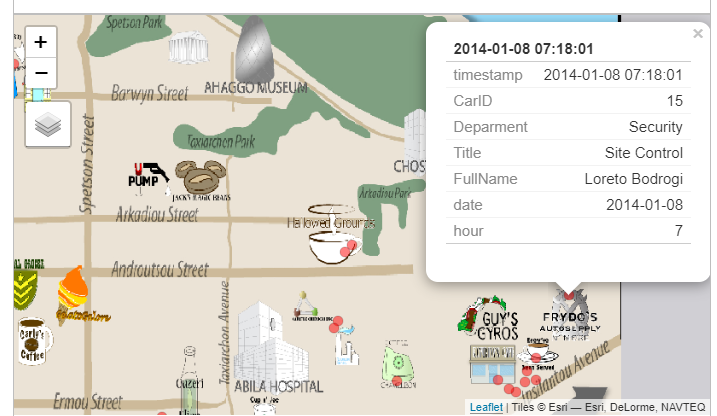{width=95%}
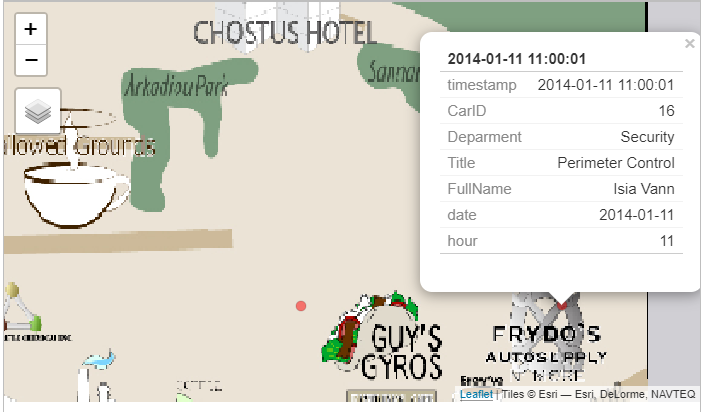{width=95%}

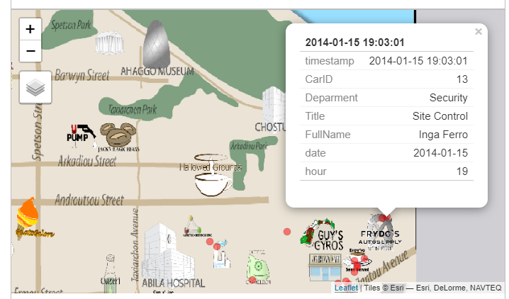{width=95%}
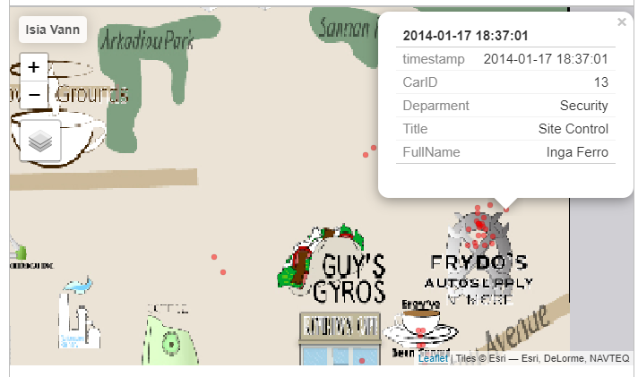{width=95%}


**2. Spetsons Park**

On _January 07, 2014, 3:25_, Isia Vann visited this place which is very unusual especially in the wee hours of the morning.

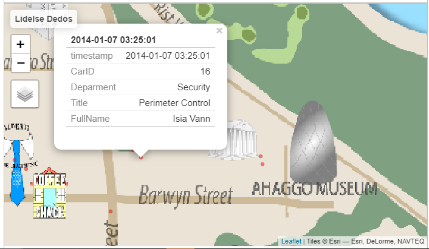{width=95%}


**3. CEO's house**

On _January 10, 2014, 23:23_, Axel Calzas visited the place where the CEO is residing, he was followed by Kanon Herrero at arond _23:33_
After a few hours, Felix Balas can also be seen around the vicinity On _January 11, 2014, 00:25_.

Photo Evidences|   

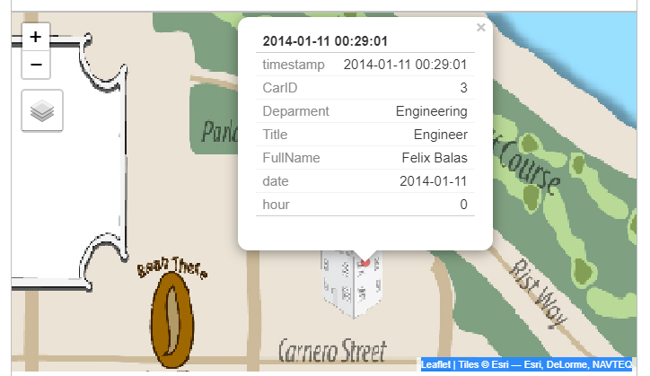{width=95%}
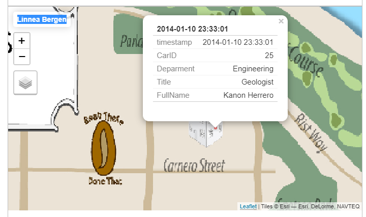{width=95%}

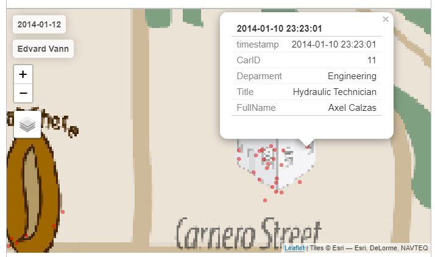{width=95%}


**4. Chostus Hotel**

On _January 08, 2014, around 13:00_, both _Brand Tempestad_ and _Elsa Orilla_ were around the vicinity of hotel.
This is unusual because it is still office hours on a weekday and they were in a hotel.

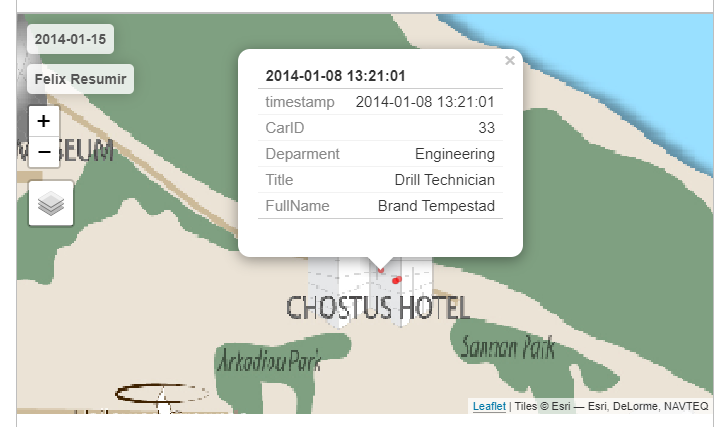{width=95%}

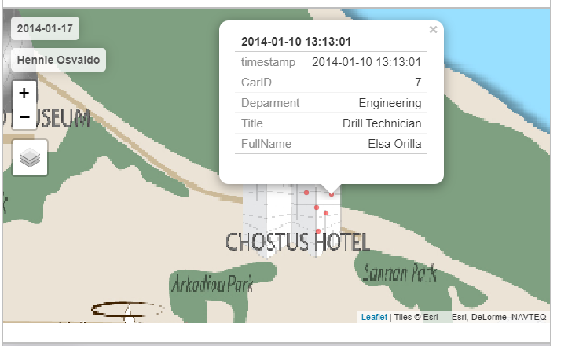{width=95%}


**5. Warehouse near Sannan Park**


On _January 10, 2014, 22:20_, Minke Mies visited this place. He also frequently visits the location around the _Frydos Autosupply n More_.
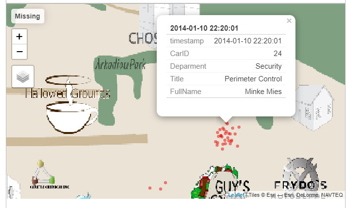{width=95%}


# 5. Conclusion

This assignment attempts to solve the 2021 VAST Challenge: Mini-Challenge 2 by applying different visual analytics concepts, methods, and techniques.


The interactive bar chart was used to identity the most popular locations which is Katerina's Cafe while interactive heatmap was used to determine the day and time when GAStech employees visit the place. 
The interactive boxplot was used to perform initial analysis of outliers while _plot_anomaly_diagnostics_ function was used to diagnose unusual purchases particularly the _10,000_ transaction in _Frydos Autosupply n More_. 


Interactive heatmap was also used to assess the anomalies where it shows the transactions with the missing credit card and loyalty card data.
Adding the gps and car data and plotting the movement path using _tmap_, 4 employees were identified who may be involved in the suspicious transactions in _Frydos Autosupply n More_.


An approach was proposed to determine the owners of the loyalty and credit card data. 
It involves mapping the credit card transaction purchases timestamp against the interactive 'Point of Interest' map.


Similar to POI, relationship among the GASTech personnel was establish based on their 'close contact' with each other where they are meeting at the same place and at the same time.
An interactive network graph and heatmap were used to show the GAStech personel relationships based on the number of their interactions.


Synthesizing the information from all the questions 1 to 4 and using interactive POI maps, several locations where identified to be the place where suspicious activities are happening.


Using relevant R data visualisation and data analysis packages, the previous submissions from 2014 VAST Challenge were enhanced by adding interactive features and making the visualisation reproducible.


Finally, this assignment can still be further improved by using RShiny App and have a more friendly user interface to perform the investigation.


# 6. References

* [ISSS608 Assignment Instructions](https://isss608.netlify.app/assignment.html)

* [VAST Challenge 2021: Mini-Challenge 2](https://vast-challenge.github.io/2021/MC2.html)

* [VAST Challenge 2014: MC2 - Patterns of Life Analysis Benchmark Repository](http://visualdata.wustl.edu/varepository/VAST%20Challenge%202014/challenges/MC2%20-%20Patterns%20of%20Life%20Analysis/)

* Whiting, Mark & Cook, Kristin & Grinstein, Georges & Liggett, Kristen & Cooper, Michael & Fallon, John & Morin, Marc. (2014). [VAST challenge 2014: The Kronos incident](http://vis.cs.ucdavis.edu/vis2014papers/VIS_Conference/vast/challenge/whiting.pdf)
